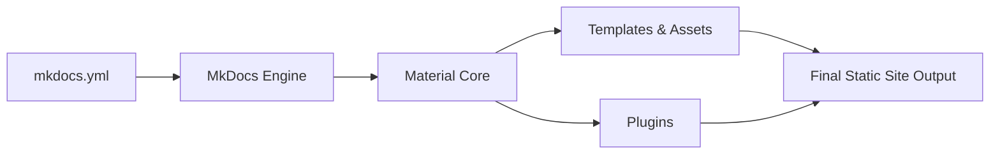

# squidfunk/mkdocs-material

> Thème et framework de documentation pour MkDocs, pour générer un site statique à partir de Markdown.

## Le problème
Publier une documentation lisible, cherchable et responsive à partir de fichiers Markdown demande sinon beaucoup de HTML, CSS et JavaScript.

## Ce que ça fait vraiment
Thème pour MkDocs : MkDocs lit `mkdocs.yml` et le Markdown, le thème Material fournit templates, styles, scripts et plugins (blog, recherche, tags, social, etc.). Personnalisation des couleurs, polices, langues (plus de 60) et surcharges de templates. Le résultat est un site statique que tu héberges toi-même. Le README cite de nombreux projets qui l'utilisent, dont Pydantic, FastAPI et LlamaIndex.

## Comment c'est branché


## Essayer
```bash
pip install mkdocs-material
```
```yaml
theme:
  name: material
```

## Coût et pièges
Gratuit. Dépend de MkDocs. Le README affiche des sponsors nombreux ; le mainteneur principal est unique d'après le nom du propriétaire, ce qui est une dépendance à suivre.

## Ce que ce n'est pas
Ce n'est pas un CMS ni un hébergeur : il produit des fichiers statiques. Le README ne détaille pas ici les autres options de déploiement.

## Alternatives
- Aucune alternative nommée dans le README.

## Pour toi
Adopter : la doc de tes projets data et MLOps en Markdown, versionnée avec le code, avec un rendu professionnel en quelques lignes de config.

