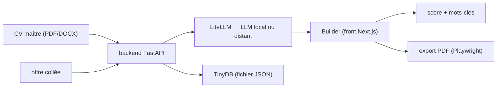

# srbhr/Resume-Matcher

> Application locale qui adapte un CV maître à chaque offre d'emploi via un LLM.

## Le problème
Réécrire son CV pour chaque annonce prend des heures et produit des versions incohérentes.
Sans retour sur les mots-clés attendus, on ne sait pas ce que l'offre demande vraiment.

## Ce que ça fait vraiment
On téléverse un CV maître (PDF ou DOCX), on colle une offre, l'outil propose un CV adapté, modifiable section par section.
Génère aussi une lettre de motivation et une préparation d'entretien ancrée dans le CV enregistré.
Score de correspondance CV/offre avec surlignage des mots-clés et suggestions d'amélioration.
Export PDF via Chromium headless, quatre gabarits, interface et contenu en cinq langues.

## Comment c'est branché


## Essayer
```bash
git clone https://github.com/srbhr/Resume-Matcher.git
cd Resume-Matcher
cd apps/backend
cp .env.example .env
uv sync
uv run app
docker run --name resume-matcher -p 3000:3000 -v resume-data:/app/backend/data ghcr.io/srbhr/resume-matcher:latest
```

## Coût et pièges
Python 3.13+, Node 22+, uv ; le fournisseur d'IA se configure dans `.env` et dans les réglages — clé à ta charge.
Avec Ollama en Docker, l'URL doit être `http://host.docker.internal:11434` et non `localhost`.

## Ce que ce n'est pas
Ce n'est pas un service géré : c'est une application à lancer soi-même, base TinyDB en fichier JSON.
Ce n'est pas un vérificateur d'ATS officiel : le score est celui de l'outil, pas celui d'un recruteur.
Le README consacre une grande part à la recherche de sponsors, pas au fonctionnement.

## Alternatives
Aucune alternative nommée dans le README.

## Pour toi
Sans rapport avec la veille technique data/IA : outil personnel de recherche d'emploi, à ranger ailleurs.
