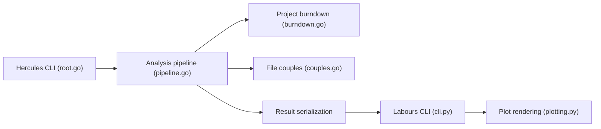

# src-d/hercules

> Moteur Go d'analyse de l'historique Git, avec tracés Python, pour équipes qui veulent des métriques de dépôt.

## Le problème
Comprendre comment un code et une équipe évoluent sur des milliers de commits demande des analyses lourdes à écrire soi-même.

## Ce que ça fait vraiment
`hercules` exécute un graphe d'analyses sur tout l'historique (branches et merges inclus) et sort du YAML ou du Protocol Buffers ; `labours` (Python) trace les résultats : burndown du projet, des fichiers, des personnes, matrice d'écrasements, propriété du code, couplage fichiers/développeurs (embeddings Swivel), points chauds structurels, séries de commits alignées, sentiment des commentaires (TensorFlow). Les plugins et la fusion de résultats sont documentés.

## Comment c'est branché


## Essayer
```bash
pip3 install labours
hercules --burndown https://github.com/go-git/go-git | labours -m burndown-project --resample month
hercules --help
```

## Coût et pièges
Gratuit. Le mode « memory » exige que le dépôt tienne en RAM ; le burndown peut saturer la mémoire (hibernation, `--first-parent`). Couples et sentiment demandent TensorFlow.

## Ce que ce n'est pas
Pas maintenu activement : dernier push en février 2023. Licence présente mais non identifiée par GitHub : à vérifier avant tout usage.

## Alternatives
- git-of-theseus : même burndown, mais beaucoup plus lent selon le README.

## Pour toi
À surveiller : analyses de dépôt originales, mais projet dormant et licence floue ; à tester ponctuellement, pas à intégrer.

