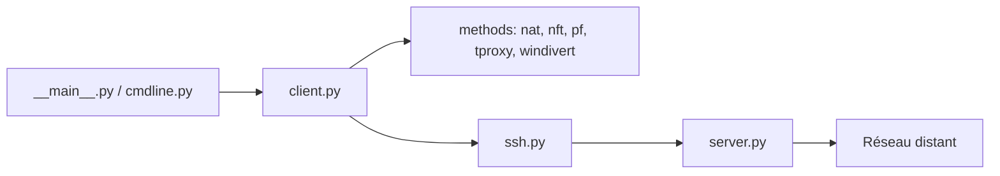

# sshuttle/sshuttle

> Proxy transparent façon VPN sur SSH, pour accéder à un réseau distant sans être admin.

## Le problème
Accéder à un réseau distant sans VPN, ou avec un VPN pénible, oblige à créer un port forward par hôte et par port.

## Ce que ça fait vraiment
Capture localement le trafic IP vers des sous-réseaux choisis et le fait passer par une connexion SSH vers un serveur qui le réinjecte dans le réseau distant. Évite le TCP-sur-TCP. Le code offre des méthodes de pare-feu interchangeables : nat, nft, pf, ipfw, tproxy, windivert. Peut tourner comme service.

## Comment c'est branché

## Essayer
Le README ne contient pas de commande : il renvoie à la documentation d'installation sur readthedocs.

## Coût et pièges
Gratuit. Modifie les règles de pare-feu locales, donc droits élevés nécessaires côté client. Licence LGPL-2.1.

## Ce que ce n'est pas
Pas un VPN complet : pas de chiffrement de bout en bout au-delà de SSH, et il exige un accès SSH.

## Alternatives
Aucune alternative citée dans le README (OpenSSH et PermitTunnel sont évoqués comme options écartées).

## Pour toi
À adopter : très pratique pour atteindre un cluster ou une base de données interne via SSH sans monter de VPN.

