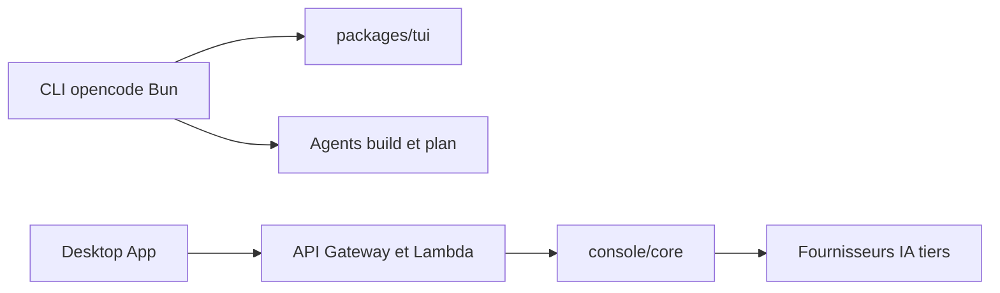

# sst/opencode

> Agent de code en terminal, agnostique du fournisseur, pour développeurs qui veulent choisir leur modèle.

## Le problème
Les agents de code sont souvent liés à un fournisseur et à son éditeur.

## Ce que ça fait vraiment
Le README fourni est partiel : il traite surtout de l'installation et des agents. Deux agents intégrés, basculés avec Tab : `build` (accès complet) et `plan` (lecture seule, demande avant les commandes bash), plus un sous-agent `general`. Application de bureau en bêta. D'après le code : monorepo avec CLI, TUI, console web, SDK et fonctions serverless.

## Comment c'est branché


## Essayer
```bash
curl -fsSL https://opencode.ai/install | bash
npm i -g opencode-ai@latest
brew install anomalyco/tap/opencode
```

## Coût et pièges
Le README ne dit rien sur les clés : l'architecture montre des fournisseurs IA tiers, donc à ta charge. Le nom « opencode » est protégé : les projets dérivés doivent préciser qu'ils ne sont pas affiliés.

## Ce que ce n'est pas
Pas documenté dans ce README : la configuration, les modèles et les tarifs renvoient à la doc en ligne. Ne pas déduire de fonction non citée. Licence non déclarée.

## Alternatives
Aucune alternative nommée dans le README.

## Pour toi
À adopter à l'essai : un agent de code libre de tout fournisseur se teste en une commande ; vérifie la licence, non déclarée.
