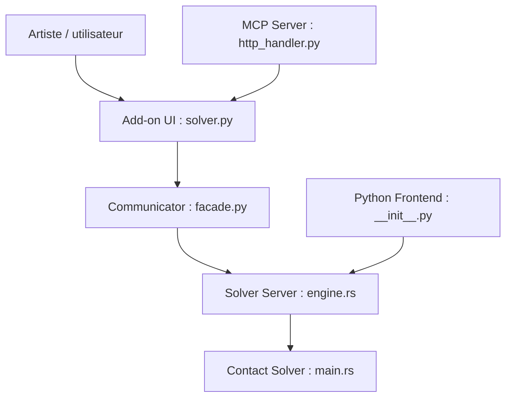

# st-tech/ppf-contact-solver

> Solveur de contacts pour simulations physiques (tissus, solides, tiges, sable), avec add-on Blender, API Python et serveur MCP.

## Le problème
Les simulations de tissu produisent des interpénétrations difficiles à corriger.

## Ce que ça fait vraiment
Détection continue de collisions et barrière cubique : chaque pas réussi est garanti sans intersection, mais le solveur peut planter ou stagner dans des cas extrêmes. Frontaux : add-on Blender (simulation locale ou distante) et JupyterLab en Python. Backends CUDA, ROCm, Metal et CPU. Un serveur MCP permet de piloter Blender par un LLM.

## Comment c'est branché


## Essayer
```bash
./ppf-contact-solver
docker run --rm -it --name ppf-contact-solver --gpus all -p 8080:8080 -p 9090:9090 -e WEB_PORT=8080 ghcr.io/st-tech/ppf-contact-solver-compiled:latest
```

## Coût et pièges
GPU récent recommandé ; CPU et Metal bien plus lents. Docker réservé à x86_64 avec NVIDIA. Location GPU possible (AWS autour de 1 $/h, vast.ai sous 0,5 $/h selon le README). Penser à supprimer les instances.

## Ce que ce n'est pas
Pas temps réel, pas différentiable, pas le plus rapide : le README l'écrit, et déconseille l'usage en production. ROCm jamais testé sur matériel réel.

## Alternatives
Aucune alternative nommée dans le README (le FAQ se compare à des produits commerciaux sans les nommer).

## Pour toi
À surveiller : intéressant pour la simulation GPU (données synthétiques, 3D), mais non différentiable donc inutile pour l'apprentissage par gradient.

