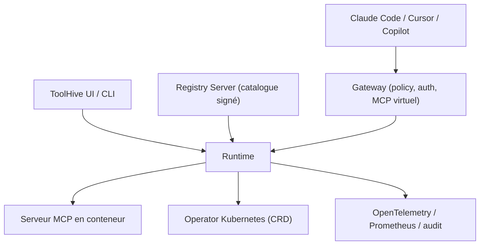

# stacklok/toolhive

> Plateforme qui fait tourner n'importe quel serveur MCP en conteneur isolé, avec politique et audit.

## Le problème
Les serveurs MCP tournent sur le poste du développeur avec ses identifiants, sans isolation,
sans journal et sans visibilité pour l'équipe sécurité.

## Ce que ça fait vraiment
Trois composants. La **Gateway** définit des points d'accès dédiés, orchestre plusieurs outils
en un MCP virtuel avec moteur de workflow déterministe, applique politiques, authentification
(OIDC/OAuth pour le SSO) et audit, et filtre les outils et leurs descriptions pour réduire la
consommation de tokens. Le **Registry Server** curate un catalogue de serveurs de confiance,
s'intègre au registre MCP officiel, vérifie la provenance et signe les serveurs. Le
**Runtime** déploie en local via Docker ou Podman, ou en cluster via un opérateur Kubernetes
avec CRD, OpenTelemetry et Prometheus. Deux interfaces : une UI desktop et une CLI.

## Comment c'est branché

## Essayer
Aucune commande n'est donnée dans le README : il renvoie vers les pages Downloads et les
quickstarts (app desktop, CLI, opérateur Kubernetes).

## Coût et pièges
Le cœur est open source. Stacklok vend une édition Enterprise avec des capacités
supplémentaires, et le README pousse explicitement vers ce chemin de montée en charge — la
frontière open source / payant est à vérifier avant d'industrialiser. Chaque serveur MCP
tourne en conteneur : Docker ou Podman requis en local, un cluster sinon.

## Ce que ce n'est pas
Ce n'est pas un serveur MCP : c'est ce qui les exécute et les gouverne. Ce n'est pas un SaaS —
c'est justement l'argument avancé face aux solutions hébergées. La réduction de tokens
annoncée « jusqu'à 85 % » vient du filtrage d'outils et de la recherche sémantique, elle
dépend entièrement de ton catalogue.

## Alternatives
- Le registre MCP officiel, avec lequel ToolHive s'intègre plutôt que de le remplacer.
- Les solutions MCP en SaaS, écartées ici pour raisons de conformité.

## Pour toi
Le bon niveau d'abstraction dès que plusieurs personnes utilisent des MCP dans la même boîte.
