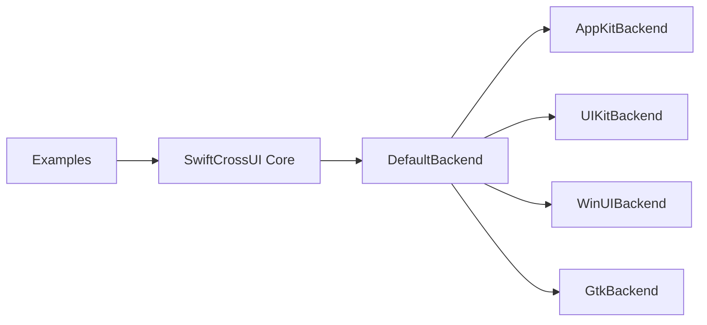

# stackotter/swift-cross-ui

> Framework Swift inspiré de SwiftUI pour bâtir des applications multiplateformes natives.

## Le problème
SwiftUI est limité aux plateformes Apple ; viser Linux, Windows ou Android oblige à réécrire l'interface.

## Ce que ça fait vraiment
Reprend une partie de l'API SwiftUI (App, Scene, View, `@State`) et l'adapte via des backends : AppKit (macOS), UIKit (iOS/tvOS), WinUI (Windows), Gtk 4 et Gtk3 (Linux, aussi macOS/Windows), Android. `DefaultBackend` choisit selon l'OS. Le README avoue une documentation en cours d'écriture ; 217 issues ouvertes.

## Comment c'est branché


## Essayer
```bash
git clone https://github.com/moreSwift/swift-cross-ui
cd swift-cross-ui/Examples
swift-bundler run CounterExample
```

## Coût et pièges
Gratuit ; Swift 5.10+ et Swift Bundler pour les exemples. Gtk 4 requis pour le backend Linux. La compatibilité avec SwiftUI n'est pas totale.

## Ce que ce n'est pas
Pas une copie de SwiftUI : le README dit ne pas chercher la parité.

## Alternatives
Aucune alternative nommée dans le README.

## Pour toi
À ignorer : interface native en Swift, sans rapport avec les tâches data, IA ou MLOps.

