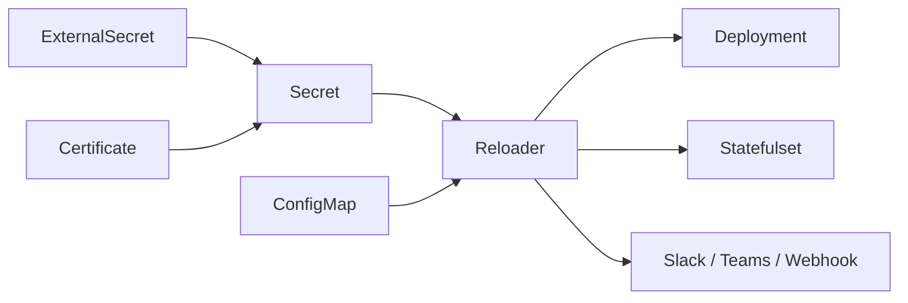

# stakater/Reloader

> Contrôleur Kubernetes qui relance les workloads quand un ConfigMap ou Secret change.

## Le problème
Kubernetes ne redémarre rien quand un `Secret` ou un `ConfigMap` référencé est mis à jour :
les pods gardent l'ancienne configuration, credentials périmés compris.

## Ce que ça fait vraiment
Surveille `Secrets`, `ConfigMaps` et, en option, les secrets montés via CSI (`SecretProviderClassPodStatus`),
et déclenche un rollout sur Deployment, StatefulSet, DaemonSet, DeploymentConfig, ArgoRollout ou CronJob.
Le déclenchement se pilote par annotations : `auto`, `reload` nommé, mode `search`+`match`, `ignore`,
pause temporisée. Deux stratégies : `env-vars` (défaut) ou `annotations`, préférée en GitOps pour éviter
la dérive. Alertes optionnelles vers Slack, Teams, Google Chat ou webhook.

## Comment c'est branché


## Essayer
```bash
helm repo add stakater https://stakater.github.io/stakater-charts
helm repo update
helm install reloader stakater/reloader
kubectl apply -f https://raw.githubusercontent.com/stakater/Reloader/master/deployments/kubernetes/reloader.yaml
```

## Coût et pièges
L'OSS est gratuit ; images signées avec SBOM, SLA et provenance d'artefacts sont réservés à
**Reloader Enterprise** (contact commercial). Kubernetes ≥ 1.19. Un seul type de ressource peut être
ignoré à la fois : ignorer `configmaps` **et** `secrets` provoque une erreur.

## Ce que ce n'est pas
Pas un gestionnaire de secrets : il réagit aux changements, il ne les stocke ni ne les fait tourner.
Côté CSI, il réagit au statut du driver, pas aux coffres externes. Licence non déclarée dans le README.

## Alternatives
Aucun dépôt alternatif n'est nommé dans le README.

## Pour toi
Le petit contrôleur qui évite les incidents « la clé a tourné mais le pod ne le sait pas ».
