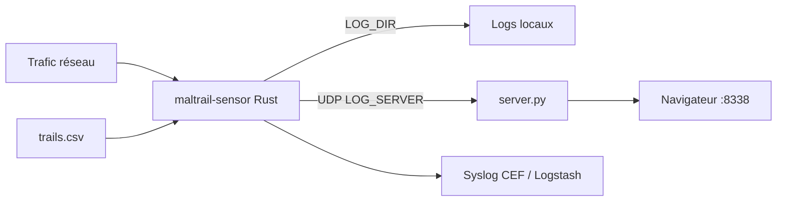

# stamparm/maltrail

> Détecteur défensif de trafic réseau qui repère les échanges avec des infrastructures malveillantes connues, pour équipes sécurité.

## Le problème
Sans surveillance par indicateurs, une machine qui contacte un domaine ou une IP de malware passe inaperçue dans le trafic réseau ordinaire.

## Ce que ça fait vraiment
Un capteur (Rust, libpcap) compare domaines, URL, IP, `IP:port` et User-Agent observés à des « trails » (indicateurs issus de fichiers statiques, de 42 flux publics et de listes de l'opérateur). Il ajoute quelques heuristiques (scans, DGA, téléchargements suspects). Chaque détection devient un événement écrit en local, envoyé à un serveur Python (interface web, API), en syslog CEF ou en JSON Logstash.

## Comment c'est branché


## Essayer
```bash
sh install.sh --dry-run
sh install.sh --role sensor
sensor/target/release/maltrail-sensor -T
python3 server.py --detect-test
```

## Coût et pièges
Gratuit. Le tableau de bord écoute par défaut sur `0.0.0.0` avec `admin` / `changeme!` : changer `USERS` et `HTTP_ADDRESS` avant toute exposition. Le capteur demande `CAP_NET_RAW`/`CAP_NET_ADMIN`, et les logs ne sont ni tournés ni purgés.

## Ce que ce n'est pas
Ni un EDR ni un IPS : il détecte, il ne bloque pas. Il ne remplace pas la télémétrie des postes. La détection dépend de la fraîcheur des trails, dont la partie statique est un dépôt séparé sous licence distincte. Les logs contiennent des IP, parfois données personnelles.

## Alternatives
Aucune alternative nommée dans le README (seulement des intégrations : Wazuh, Splunk, OPNsense, pfBlockerNG).

## Pour toi
Adopter si tu as un réseau à surveiller : projet ancien, MIT, actif, qui s'installe en une commande ; sans réseau à observer, il n'a pas d'usage.
