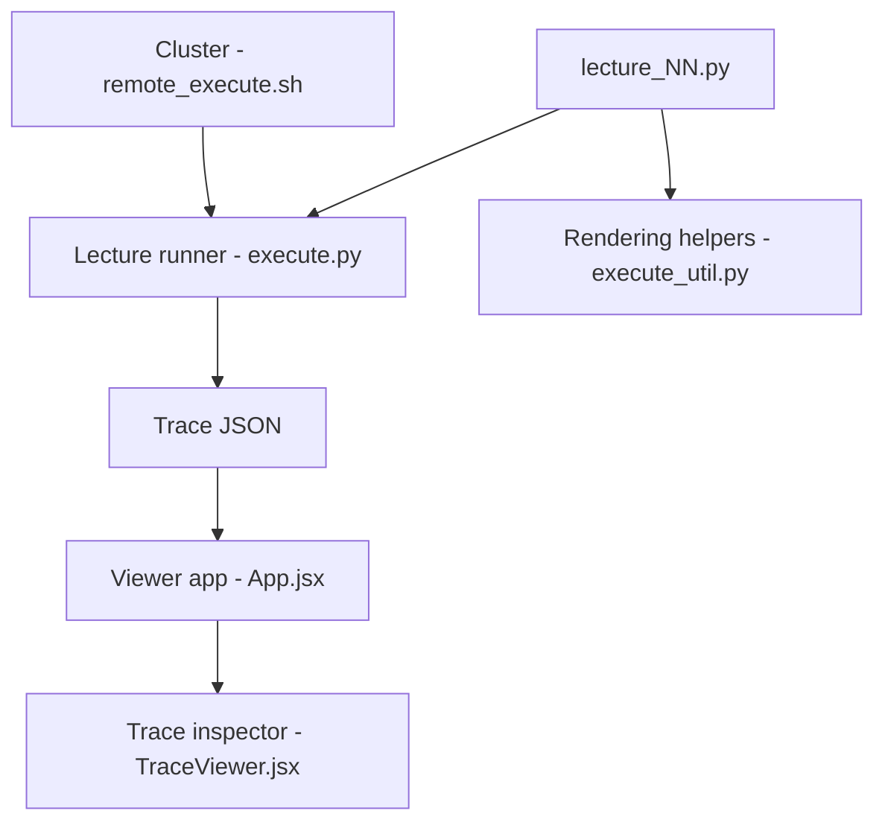

# stanford-cs336/spring2025-lectures

> Supports du cours Stanford CS336 « Language modeling from scratch » : cours exécutables en Python et PDF.

## Le problème
Suivre un cours sur la construction de modèles de langage avec du code qui s'exécute et se laisse inspecter, pas seulement des diapositives.

## Ce que ça fait vraiment
Les cours exécutables sont des `lecture_*.py` ; `execute.py` en génère une trace JSON (`var/traces/`) et met en cache les images. Un visualiseur React (Vite) affiche la trace. Les cours non exécutables sont des PDF dans `nonexecutable/`. Le graphe cite tokens, primitives de modèle, noyaux GPU et d'autres sujets selon les fichiers.

## Comment c'est branché


## Essayer
```bash
python execute.py -m lecture_01
./remote_execute.sh lecture_01
npm create vite@latest trace-viewer -- --template react
npm run dev
```

## Coût et pièges
Gratuit. Le README est court : l'environnement Python et les dépendances ne sont pas décrits, et la partie cluster slurm est « incomplète » de l'aveu des auteurs. Dernier push le 2026-03-31, dépôt créé le même jour.

## Ce que ce n'est pas
Ce n'est pas une librairie ni un framework d'entraînement : c'est du matériel de cours. Les PDF ne s'exécutent pas.

## Alternatives
Aucune alternative nommée dans le README.

## Pour toi
À surveiller : pertinent pour se former sur les LLM de zéro, mais sans mode d'emploi d'installation, donc à tester avant de s'y fier.

