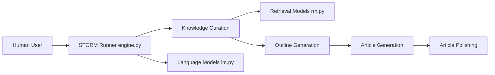

# stanford-oval/storm

> Bibliothèque Python de Stanford qui rédige des articles type Wikipédia sourcés via recherche web et LLM.

## Le problème
Faire écrire un long article sourcé à un LLM donne un texte superficiel : il ne sait pas quelles questions poser.

## Ce que ça fait vraiment
STORM : recherche guidée par perspectives et conversations simulées rédacteur/expert, puis plan, article cité et polissage.
Co-STORM : discours collaboratif avec experts LLM, modérateur et humain, carte mentale partagée.
Modèles et embeddings via litellm ; retrievers You, Bing, Serper, Brave, SearXNG, DuckDuckGo, Tavily, VectorRM (vos documents).
Construit sur dspy ; datasets FreshWiki et WildSeek.

## Comment c'est branché


## Essayer
```bash
pip install knowledge-storm
git clone https://github.com/stanford-oval/storm.git
cd storm
pip install -r requirements.txt
python examples/storm_examples/run_storm_wiki_gpt.py --output-dir $OUTPUT_DIR --retriever bing --do-research --do-generate-outline --do-generate-article --do-polish-article
```

## Coût et pièges
Clé LLM et clé de moteur de recherche à ta charge ; nombreux appels par article. Dernier push en septembre 2025.

## Ce que ce n'est pas
Pas des articles publiables en l'état : le README reconnaît qu'ils demandent beaucoup de corrections. Prototype de recherche.

## Alternatives
Aucune alternative nommée dans le README.

## Pour toi
Bon modèle d'architecture pour un pipeline de deep research sourcé ; à étudier plus qu'à déployer.
