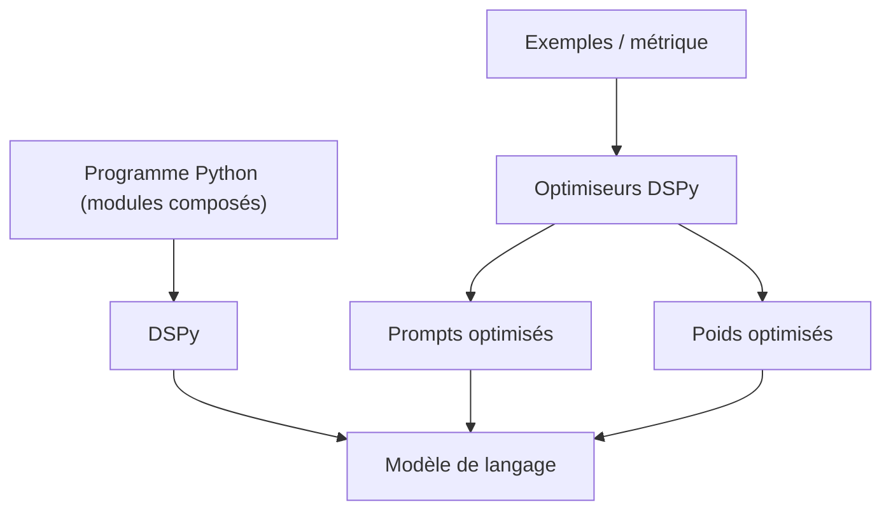

# stanfordnlp/dspy

> Framework pour programmer des systèmes IA modulaires et en optimiser prompts et poids.

## Le problème
Un système bâti sur des prompts écrits à la main casse au moindre changement de modèle, et
l'améliorer revient à tâtonner sur des chaînes de caractères.

## Ce que ça fait vraiment
Fait écrire du code Python composable plutôt que des prompts : DSPy signifie *Declarative
Self-improving Python*.
Fournit des algorithmes d'optimisation qui portent à la fois sur les prompts et sur les poids.
Vise aussi bien les classifieurs simples que les pipelines RAG élaborés ou les boucles d'agent.
Le reste — modules, signatures, optimiseurs — est renvoyé au site de documentation dspy.ai.

## Comment c'est branché


## Essayer
```bash
pip install dspy
pip install git+https://github.com/stanfordnlp/dspy.git
```

## Coût et pièges
La bibliothèque est gratuite ; l'optimisation multiplie les appels au modèle, donc la facture,
puisqu'elle évalue de nombreuses variantes. Le README ne donne ni prérequis Python ni exemple
de code : tout est sur dspy.ai.

## Ce que ce n'est pas
Ce n'est pas documenté ici : le README tient en une page et renvoie au site, ce qui empêche
d'évaluer l'outil depuis le dépôt seul. Ce n'est pas un framework d'agent au sens orchestration :
il produit et optimise les appels, il ne gère ni état durable ni reprise.

## Alternatives
Aucune alternative nommée dans le README.

## Pour toi
La bonne réponse quand tes prompts sont devenus un actif à maintenir plutôt qu'un brouillon.
