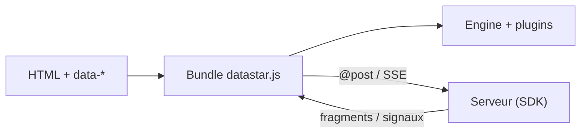

# starfederation/datastar

> Framework hypermédia léger : réactivité côté page par attributs `data-*`, mises à jour poussées par le serveur.

## Le problème
Construire une interface réactive ou temps réel impose souvent un framework JavaScript lourd et une application monopage.

## Ce que ça fait vraiment
Une balise script (v1.0.3, 11,81 KiB selon le README) ajoute des signaux et des attributs `data-bind`, `data-text`, `data-on` ; les événements appellent le serveur (`@post`), qui répond avec des fragments HTML ou des signaux, par événements serveur (SSE). Le dépôt contient aussi des SDK serveur en de nombreux langages, un site, des exemples et des extensions d'éditeur.

## Comment c'est branché


## Essayer
```bash
# Aucune commande shell ; le README propose une balise script :
# <script type="module" src="https://cdn.jsdelivr.net/gh/starfederation/datastar@v1.0.3/bundles/datastar.js"></script>
```

## Coût et pièges
Gratuit. Le README est court (guide de démarrage en lien). Le graphe d'architecture cite un script de 14,5 KiB, différent de l'annonce du README.

## Ce que ce n'est pas
Pas un framework serveur : il faut un back-end qui envoie du HTML ou des événements.

## Alternatives
Aucune alternative nommée dans le README.

## Pour toi
À surveiller : intéressant pour des tableaux de bord temps réel légers sans chaîne de build JavaScript ; sans objet pour de l'entraînement de modèles.

