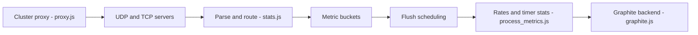

# statsd/statsd

> Démon Node.js qui reçoit des compteurs et chronomètres en UDP/TCP et envoie des agrégats vers Graphite.

## Le problème
Mesurer n'importe quel événement applicatif sans ralentir l'application ni créer d'indicateurs à l'avance.

## Ce que ça fait vraiment
Reçoit des lignes `nom:valeur|type` (par exemple `foo:1|c`), regroupe par « bucket », puis à chaque intervalle de flush (10 s par défaut) calcule débits et statistiques de timers et les envoie aux backends (Graphite, console, répéteur). Interface d'admin TCP, proxy de cluster à hachage de noms, espaces de noms.

## Comment c'est branché


## Essayer
```bash
node stats.js /path/to/config
echo "foo:1|c" | nc -u -w0 127.0.0.1 8125
./run_tests.sh
```

## Coût et pièges
Gratuit. Il faut Node.js et un fichier de config issu de `exampleConfig.js`. Dernier push en mai 2025 (plus d'un an).

## Ce que ce n'est pas
Pas un stockage ni un tableau de bord : il agrège puis transmet. Les valeurs doivent plutôt être des entiers.

## Alternatives
Aucune alternative nommée dans le README (le Perl StatsD de Flickr est cité comme inspiration).

## Pour toi
À surveiller : protocole encore répandu pour instrumenter du code, mais peu actif ; un agent récent peut le remplacer.

