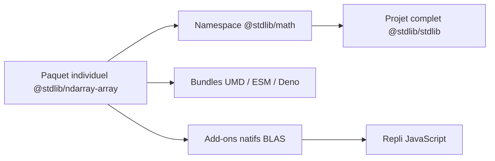

# stdlib-js/stdlib

> Bibliothèque standard de calcul numérique et scientifique en JavaScript, pour navigateur et Node.js.

## Le problème
Faire des maths, des statistiques et de la manipulation de tableaux en JavaScript oblige à assembler des paquets hétérogènes.

## Ce que ça fait vraiment
Des centaines de paquets npm indépendants : 150+ fonctions mathématiques spéciales, 35+ lois de probabilité, 40+ générateurs pseudo-aléatoires, utilitaires, assertions, 50+ jeux de données, API de tracé, ndarray, REPL. Les implémentations natives (C, BLAS) ont un repli en JavaScript pur. Chaque paquet a ses déclarations TypeScript.

## Comment c'est branché


## Essayer
```bash
npm install @stdlib/stdlib
npm install @stdlib/ndarray-array
npm install -g @stdlib/stdlib
stdlib repl
```

## Coût et pièges
Gratuit. L'installation du projet entier est lente : le README recommande les paquets individuels. Les add-ons natifs demandent make, gcc/g++, gfortran ; sinon repli JavaScript. Le README est tronqué par endroits (tableau de statut vide, ligne de prérequis Node mal rendue).

## Ce que ce n'est pas
Pas un équivalent complet de l'écosystème Python (le README se compare à Python, Julia, R, MATLAB pour l'analyse de données mais ne chiffre rien). Les performances annoncées ne sont pas mesurées dans le README.

## Alternatives
Aucun dépôt nommé comme alternative dans le README.

## Pour toi
À surveiller : utile si tu dois calculer côté navigateur ou Node (démos, dashboards), inutile si ton pipeline reste en Python.

