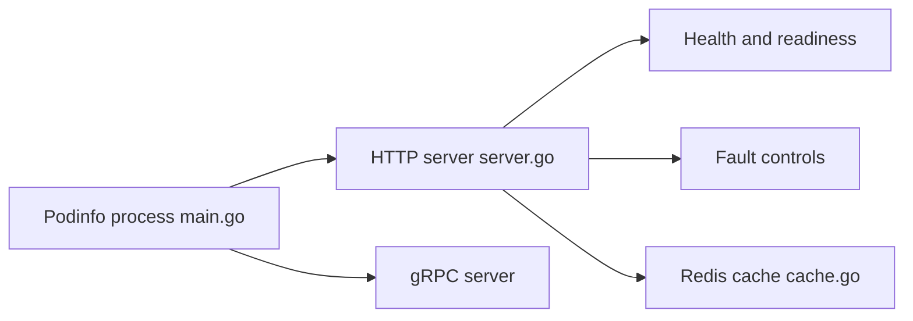

# stefanprodan/podinfo

> Petit service Go servant de démo et de cible de test pour les bonnes pratiques de microservices Kubernetes.

## Le problème
Tester un déploiement, une sonde ou un canary demande une application réaliste et inoffensive.

## Ce que ça fait vraiment
Expose des routes HTTP et gRPC : informations d'exécution, `/healthz`, `/readyz`, `/metrics`, injection de fautes et de latence, JWT, cache Redis, stockage disque, écho vers un backend, websocket et Swagger. Se déploie avec Timoni, Helm, Kustomize ou Docker. Utilisé par Flux et Flagger pour les tests.

## Comment c'est branché


## Essayer
```bash
docker run -dp 9898:9898 stefanprodan/podinfo
helm repo add podinfo https://stefanprodan.github.io/podinfo
kubectl apply -k github.com/stefanprodan/podinfo//kustomize
```

## Coût et pièges
Gratuit ; Kubernetes 1.23+ minimum pour l'installation sur cluster. Les routes `/panic` et `/fault_injection/*` sont volontairement destructrices.

## Ce que ce n'est pas
Pas une application métier : une charge factice de démonstration.

## Alternatives
Aucune alternative nommée dans le README.

## Pour toi
À surveiller : sert de cible de test pour des déploiements MLOps (canary, GitOps), mais ne sera utile que sur des clusters.

