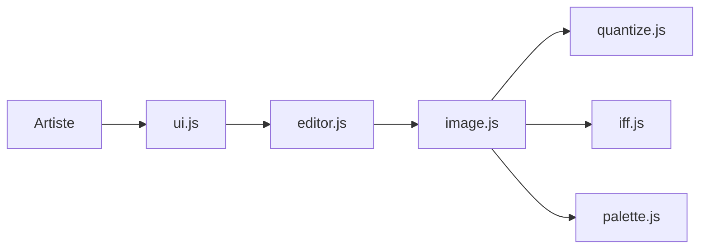

# steffest/DPaint-js

> Éditeur d'images web inspiré de Deluxe Paint, tourné vers les formats rétro Amiga.

## Le problème
Les formats Amiga (IFF ILBM, icônes, ADF) n'ont plus d'outils modernes pour les lire ou les produire.

## Ce que ça fait vraiment
Éditeur en JavaScript pur, sans dépendance, qui tourne dans le navigateur : calques, sélections, dithering, réduction de palette (12 bits OCS, 9 bits Atari ST), cycle de couleurs, animation par images. Lit et écrit IFF ILBM/ANIM, icônes Amiga et disques ADF, avec un émulateur Amiga intégré (fichiers non inclus).

## Comment c'est branché


## Essayer
```bash
npx serve
npm install
npm run build
```
La version en ligne est sur dpaint.app ; il faut servir `index.html` depuis un serveur web.

## Coût et pièges
Gratuit, aucun compte ni suivi. Le navigateur Brave perturbe le rendu (farbling).

## Ce que ce n'est pas
Pas une application à installer ; pas un outil de retouche photo professionnel.

## Alternatives
Aucune alternative citée dans le README.

## Pour toi
À ignorer : outil de pixel art rétro, sans rapport avec data, IA ou MLOps, bien que sa quantification de couleurs soit documentée.

