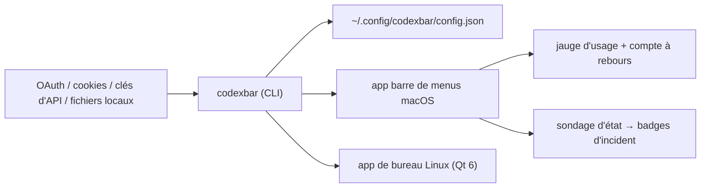

# steipete/CodexBar

> Application de barre de menus qui affiche les quotas et dépenses de ses fournisseurs d'IA.

## Le problème
Chaque fournisseur d'IA a sa fenêtre de quota, son heure de remise à zéro et son tableau de bord :
on découvre la limite au moment où l'on en a le plus besoin.

## Ce que ça fait vraiment
Un élément de barre de menus par fournisseur (ou un mode fusionné avec sélecteur), affichant fenêtres
de session, hebdomadaires et mensuelles avec compte à rebours jusqu'à la remise à zéro, soldes de
crédits, tableaux de dépense et analyses de coût locales. Plus de soixante fournisseurs couverts.
L'authentification réutilise ce qui existe déjà : OAuth, device flow, clés d'API, cookies de
navigateur, fichiers locaux. Une CLI `codexbar` gère la configuration et sert les scripts et la CI.
Versions macOS, Linux (Qt 6) et widget Omarchy.

## Comment c'est branché


## Essayer
```bash
brew install --cask codexbar
brew install steipete/tap/codexbar
codexbar config providers
codexbar config enable --provider grok
printf '%s' "$ELEVENLABS_API_KEY" | codexbar config set-api-key --provider elevenlabs --stdin
```

## Coût et pièges
macOS 14+ ou Linux avec glibc 2.39+ et Qt 6.4+. L'accès disque complet n'est requis que pour lire
les cookies Safari ; l'import de cookies Chromium demande le trousseau. L'option « Adaptive
(agent-aware) » demande l'autorisation avant d'inspecter la liste des processus en cours, ligne de
commande comprise. Les jetons vivent dans le fichier de configuration, en permissions restreintes.

## Ce que ce n'est pas
Pas un outil de maîtrise des coûts : il montre, il ne limite rien. Pas un service : tout est lu en
local, aucun mot de passe n'est stocké. Pas exhaustif à ta place — chaque fournisseur exige sa
propre source d'authentification, à installer et à connecter une par une.

## Alternatives
- `ccusage` : nommé au crédit comme l'inspiration du suivi de coût.
- Win-CodexBar / CodexBar for Windows : les portages Windows nommés.

## Pour toi
Confort pur ; utile si tu jongles avec plusieurs abonnements d'agents, inutile sinon.
