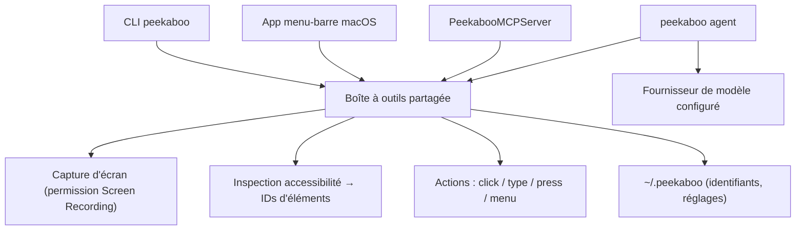

# steipete/Peekaboo

> **One sentence.** A macOS CLI that captures the screen, reads the accessibility tree and drives native windows.

## The problem

Automating a macOS app that exposes no API means stitching together AppleScript, fixed-coordinate clicks and screenshots no script can read back.
And an LLM agent that wants to act on the desktop has neither a map of clickable elements nor a stable way to address them.

## What it actually does

- Captures the screen or a window (`see`), with or without UI element extraction.
- Builds a structured map of an application's UI through accessibility, with reusable opaque element IDs (`see --app Finder --json`).
- Acts on those elements: `click`, `type`, `press`, `scroll`, `drag`, `set-value`, `action`, pinned to one window via `--window-id`.
- Drives the surrounding system: `app`, `window`, `menu`, `menubar`, `dock`, `dialog`, `space`.
- Ships the same toolset in three shapes: a CLI, a signed menu-bar app (DMG), and an MCP server exposable to Codex, Claude Code or Cursor.
- Includes an agent (`peekaboo agent "…"`) chaining observation and action from natural language — it requires a configured model provider.

## How it is wired

The loop the README states: observe the current screen, pick an element from the result, act on it. The three front ends share one toolset.



## Trying it

```sh
brew install openclaw/tap/peekaboo
peekaboo permissions status
peekaboo see --no-elements --mode screen --path /tmp/peekaboo-screen.png
peekaboo see --app Finder --json
peekaboo window list --app Safari --json
peekaboo click "Address and search bar" --app Safari --window-id 12345
peekaboo agent "Open Safari, go to github.com, and search for Peekaboo" --allow-foreground
```

The MCP variant, which needs Node.js 22 or later: `npx -y @steipete/peekaboo --version`.

## Cost and gotchas

The code is MIT and the CLI bills nothing, but the agent "needs a configured model provider": the token bill is yours (the README points to a provider reference covering hosted, compatible and local backends). Provider credentials live under `~/.peekaboo`.
Machine side: macOS 15 or later for the released CLI and app, Node.js 22 for the npm package; building from source additionally wants Swift 6.2 and the repository's submodules. Nothing runs without system permissions: Screen Recording for capture, Accessibility for inspection and control, plus an extra permission for synthetic input. Targetless chords and app/PID-only actions require explicit foreground consent.

## What it is not

It is not cross-platform: the released binaries are macOS 15+, and the README points to two separate community rewrites for Windows and Linux.
It is not a browser driver: there is a `browser` command and a Chrome DevTools MCP integration, but the tool acts on the native UI, not the DOM.
It is not a turnkey agent either: with no model provider configured it stays an observe-and-act CLI you script yourself.

## Alternatives

- `AgentDeskAI/browser-tools-mcp`: pick it when the target is a web page in a browser; Peekaboo when it is a native macOS app.
- `FelixKruger/PeekabooWin` (named in the README): the same automation loop, Windows-first, in JavaScript and PowerShell.
- `nordbyte/PeekabooX` (named in the README): the Linux-first rewrite of the same loop, in Rust and Python.

## For you

Worth it when an agent must drive a macOS application that has no API — pulling data out of a line-of-business tool, UI testing, reproducible demos. Outside that case, and especially if your workstation is not a recent Mac, skip it: this is a desktop tool, not a data-pipeline building block.
