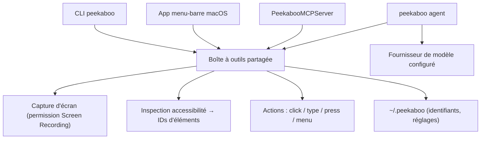

# steipete/Peekaboo

> **Une phrase.** Une CLI macOS qui capture l'écran, lit l'arbre d'accessibilité et pilote les fenêtres natives.

## Le problème

Automatiser une application macOS sans API oblige à bricoler AppleScript, des clics à coordonnées fixes et des captures d'écran qu'aucun script ne sait relire.
Et un agent LLM qui veut agir sur le bureau n'a ni carte des éléments cliquables ni moyen stable de les désigner.

## Ce que ça fait vraiment

- Capture l'écran ou une fenêtre (`see`), avec ou sans extraction des éléments d'interface.
- Produit une carte structurée de l'UI d'une application via l'accessibilité, avec des identifiants d'éléments opaques réutilisables (`see --app Finder --json`).
- Agit sur ces éléments : `click`, `type`, `press`, `scroll`, `drag`, `set-value`, `action`, en ciblant une fenêtre précise par `--window-id`.
- Pilote le système autour : `app`, `window`, `menu`, `menubar`, `dock`, `dialog`, `space`.
- Livre la même boîte à outils sous trois formes : CLI, app menu-barre signée (DMG), et serveur MCP exposable à Codex, Claude Code ou Cursor.
- Embarque un agent (`peekaboo agent "…"`) qui enchaîne observation et action en langage naturel — il exige un fournisseur de modèle configuré.

## Comment c'est branché

La boucle annoncée par le README : on observe, on choisit un élément dans le résultat, on agit dessus. Les trois façades (CLI, app, MCP) partagent le même jeu d'outils.



## Essayer

```sh
brew install openclaw/tap/peekaboo
peekaboo permissions status
peekaboo see --no-elements --mode screen --path /tmp/peekaboo-screen.png
peekaboo see --app Finder --json
peekaboo window list --app Safari --json
peekaboo click "Address and search bar" --app Safari --window-id 12345
peekaboo agent "Open Safari, go to github.com, and search for Peekaboo" --allow-foreground
```

Variante MCP, qui réclame Node.js 22 ou plus : `npx -y @steipete/peekaboo --version`.

## Coût et pièges

Le code est MIT et la CLI ne facture rien, mais l'agent « a besoin d'un fournisseur de modèle configuré » : la facture des jetons est à ta charge (le README renvoie à une référence couvrant les backends hébergés, compatibles et locaux). Les identifiants de fournisseur vivent dans `~/.peekaboo`.
Côté machine : macOS 15 ou plus pour la CLI et l'app publiées, Node.js 22 pour le paquet npm ; compiler depuis les sources demande en plus Swift 6.2 et les sous-modules du dépôt. Rien ne tourne sans permissions système : Screen Recording pour la capture, Accessibilité pour l'inspection et le contrôle, plus une permission supplémentaire pour l'injection d'entrées synthétiques. Les accords de touches sans cible et les actions par app/PID seul exigent un consentement explicite de passage au premier plan.

## Ce que ce n'est pas

Ce n'est pas multiplateforme : les binaires publiés sont macOS 15+, et le README renvoie vers deux réécritures communautaires distinctes pour Windows et Linux.
Ce n'est pas un pilote de navigateur : il y a une commande `browser` et une intégration Chrome DevTools MCP, mais l'outil agit sur l'interface native, pas sur le DOM.
Ce n'est pas non plus un agent clé en main : sans fournisseur de modèle configuré, il reste une CLI d'observation et d'action que tu scriptes toi-même.

## Alternatives

- `AgentDeskAI/browser-tools-mcp` : à préférer si la cible est une page web dans un navigateur ; Peekaboo si c'est une app macOS native.
- `FelixKruger/PeekabooWin` (cité par le README) : même boucle d'automatisation, mais orientée Windows, en JavaScript et PowerShell.
- `nordbyte/PeekabooX` (cité par le README) : la réécriture Linux de la même boucle, en Rust et Python.

## Pour toi

Utile si tu dois faire piloter par un agent une application macOS sans API — extraction depuis un logiciel métier, tests d'IHM, démos reproductibles. Hors de ce cas, et surtout si ton poste de travail n'est pas un Mac récent, passe ton chemin : c'est un outil de bureau, pas une brique de chaîne de données.
