# stephencelis/SQLite.swift

> **A type-safe Swift layer over SQLite3, so queries are written without raw SQL strings.**

## The problem

Talking to SQLite from Swift means either the C API or string literals: a typo in a column
name, a badly bound type or a forgotten `NULL` only shows up at runtime, often on a user's
device. The compiler never reads the query, and the parameter-binding boilerplate gets
rewritten table by table.

## What it actually does

The repo provides a SQL expression builder in pure Swift: `Table("users")`,
`SQLite.Expression<Int64>("id")`, then `users.filter(id == rowid)`,
`users.insert(name <- "Alice")`, `alice.update(...)`, `alice.delete()`. Column types live in
the expressions, optionality included (`Expression<String?>` for a nullable column), so
reading results is typed without manual casting.

The query layer is chainable and lazy: `db.prepare(users)` iterates rows, `db.scalar(users.count)`
returns a value. The README also lists schema query and migration, full-text search, and
first-class WAL configuration through `Connection(_, journalMode: .wal)`, `enableWAL()` and
`walCheckpoint(...)`.

Underneath, it still works as a thin wrapper over the C API: `db.prepare("INSERT INTO users (email) VALUES (?)")`
then `stmt.run(email)`, with `db.changes`, `db.totalChanges` and `db.lastInsertRowid`.
SQLCipher is supported, but only via Swift Package Manager. Linux works "with some
limitations", documented in `Documentation/Linux.md`.

## How it is wired

No code-derived diagram exists for this repo: the graph below is reconstructed from the
README alone.

```mermaid
graph LR
  A[application Swift code] --> B[Table / SQLite.Expression<T><br/>typed expression builder]
  A --> C[raw SQL strings<br/>db.prepare&#40;&quot;INSERT ...&quot;&#41;]
  B --> D[chainable query layer<br/>filter · insert · update · delete · count]
  D --> E[Connection<br/>journalMode: .wal · enableWAL&#40;&#41;]
  C --> E
  E --> F[SQLite3 / SQLCipher]
  F --> G[path/to/db.sqlite3 file]
  E --> H[Swift errors<br/>do ... catch]
```



## Trying it

The README documents no quick-start command, only installation. With Swift Package Manager,
add the dependency to `Package.swift`, then:

```bash
$ swift build
```

With CocoaPods, after adding `pod 'SQLite.swift', '~> 0.15.0'` to the Podfile:

```bash
# Using the default Ruby install will require you to use sudo when
# installing and updating gems.
[sudo] gem install cocoapods
pod install --repo-update
```

With Carthage, after adding `github "stephencelis/SQLite.swift" ~> 0.16.0` to the Cartfile,
the README says to run `carthage update`. Interactive exploration goes through the Xcode
project's playground.

## Cost and gotchas

- **No API key, no third-party service, no GPU**: everything is local and the database is a
  file. The cost is the Swift toolchain, not a subscription.
- **Name clash with SwiftUI**: the README explicitly warns to write `SQLite.Expression` rather
  than `Expression` to avoid conflicting with `SwiftUI.Expression`.
- **Versions differ between package managers**: the README suggests `from: "0.16.0"` for SPM
  and Carthage, but `'~> 0.15.0'` for CocoaPods.
- **SQLCipher is only available through Swift Package Manager** per the README, not CocoaPods
  or Carthage.
- **Linux works "with some limitations"** the README does not spell out; the manual Xcode
  sub-project install additionally requires "Embedded Binaries" steps to ship on a real device.
- **The Gitter channel is marked _experimental_** in the README; real support runs through
  Stack Overflow and issues.

## What it is not

- **It is not a database**: SQLite3 does the work, this repo is only a query-writing layer.
  Every SQLite limit (single-writer concurrency, no server) still applies.
- **It is not an object-mapping ORM**: you describe tables and expressions, not persisted
  entities; the typing protects the syntax and intent of the query, not a domain model.
- **It is not broadly cross-platform**: Apple first, Linux second and with limitations;
  nothing for Android, the web, or a non-Swift server stack.

## Alternatives

| | When to pick it |
|---|---|
| **groue/GRDB.swift** | Listed in the README's own "Alternatives" section, and present in the catalogue. A broader library (change observation, richer migrations, associations): pick it when the database is the heart of the app. Pick SQLite.swift for a thin layer focused on typed query building. |
| **FahimF/SQLiteDB** | Named in the README as another Swift wrapper, simpler and closer to hand-written SQL: pick it when compile-time typing is not the goal. |
| **ccgus/fmdb** | Cited in the README: the long-standing Objective-C wrapper, preferable in an Objective-C or mixed codebase already built around it. |

The other catalogue neighbours (`onevcat/Kingfisher`, `Juanpe/SkeletonView`,
`Dimillian/IceCubesApp`) are Swift too but do not touch persistence: not comparable.

## For you

Little direct value for a data / AI / MLOps profile: this is iOS and macOS application
tooling, not data plumbing. Keep it in mind for one case only — embedding a SQLite index or
cache inside a Swift app, for instance the output of an on-device exported model. Otherwise
walk past: on the Python side you stay with `sqlite3` and SQLAlchemy.
