# stephencelis/SQLite.swift

> **Une couche Swift typée au-dessus de SQLite3, pour écrire ses requêtes sans chaînes SQL.**

## Le problème

Parler à SQLite depuis Swift passe par l'API C ou par des chaînes de caractères : une faute de
frappe dans un nom de colonne, un type mal lié ou un `NULL` oublié ne se voient qu'à
l'exécution, souvent chez l'utilisateur. Rien dans le compilateur ne relit la requête, et le
code de liaison des paramètres se réécrit table par table.

## Ce que ça fait vraiment

Le dépôt fournit un constructeur d'expressions SQL en Swift pur : `Table("users")`,
`SQLite.Expression<Int64>("id")`, puis `users.filter(id == rowid)`, `users.insert(name <- "Alice")`,
`alice.update(...)`, `alice.delete()`. Les types des colonnes sont portés par les expressions,
y compris l'optionalité (`Expression<String?>` pour une colonne nullable), donc l'accès aux
résultats est typé sans transtypage manuel.

La couche requête est chaînable et paresseuse : `db.prepare(users)` itère les lignes,
`db.scalar(users.count)` renvoie une valeur. Le README annonce aussi la création et la
migration de schéma, la recherche plein texte, et une configuration WAL de première classe via
`Connection(_, journalMode: .wal)`, `enableWAL()` et `walCheckpoint(...)`.

En dessous, la bibliothèque reste utilisable comme simple enveloppe de l'API C :
`db.prepare("INSERT INTO users (email) VALUES (?)")` puis `stmt.run(email)`, avec
`db.changes`, `db.totalChanges` et `db.lastInsertRowid`. Le chiffrement SQLCipher est pris en
charge, mais uniquement par Swift Package Manager. Linux est supporté « avec des limitations »,
détaillées dans `Documentation/Linux.md`.

## Comment c'est branché

Aucun diagramme tiré du code n'existe pour ce dépôt : ce schéma est reconstruit depuis le seul
README.

```mermaid
graph LR
  A[code Swift de l'application] --> B[Table / SQLite.Expression<T><br/>constructeur d'expressions typé]
  A --> C[chaînes SQL brutes<br/>db.prepare&#40;&quot;INSERT ...&quot;&#41;]
  B --> D[couche requête chaînable<br/>filter · insert · update · delete · count]
  D --> E[Connection<br/>journalMode: .wal · enableWAL&#40;&#41;]
  C --> E
  E --> F[SQLite3 / SQLCipher]
  F --> G[fichier path/to/db.sqlite3]
  E --> H[erreurs Swift<br/>do ... catch]
```



## Essayer

Le README ne documente pas de commande de démarrage rapide : il documente l'installation. Par
Swift Package Manager, ajouter la dépendance à `Package.swift` puis :

```bash
$ swift build
```

Par CocoaPods, après avoir ajouté `pod 'SQLite.swift', '~> 0.15.0'` au Podfile :

```bash
# Using the default Ruby install will require you to use sudo when
# installing and updating gems.
[sudo] gem install cocoapods
pod install --repo-update
```

Par Carthage, après avoir ajouté `github "stephencelis/SQLite.swift" ~> 0.16.0` au Cartfile,
le README indique de lancer `carthage update`. L'exploration interactive passe par le
playground du projet Xcode.

## Coût et pièges

- **Pas de clé d'API, pas de service tiers, pas de GPU** : tout est local, la base est un
  fichier. Le coût est celui de l'écosystème Swift, pas d'un abonnement.
- **Collision de noms avec SwiftUI** : le README prévient explicitement qu'il faut écrire
  `SQLite.Expression` et non `Expression` pour éviter le conflit avec `SwiftUI.Expression`.
- **Versions désalignées entre gestionnaires** : le README propose `from: "0.16.0"` pour SPM
  et Carthage, mais `'~> 0.15.0'` pour CocoaPods.
- **SQLCipher n'est disponible que via Swift Package Manager** — pas par CocoaPods ni Carthage
  d'après le README.
- **Linux fonctionne « avec des limitations »** non détaillées dans le README ; l'installation
  manuelle par sous-projet Xcode demande en plus des étapes d'« Embedded Binaries » pour
  déployer sur un appareil réel.
- **Le canal de support Gitter est marqué _experimental_** dans le README ; le support réel
  passe par StackOverflow et les issues.

## Ce que ce n'est pas

- **Ce n'est pas une base de données** : SQLite3 fait le travail, ce dépôt n'est qu'une couche
  d'écriture des requêtes. Toutes les limites de SQLite (concurrence en écriture, absence de
  serveur) restent entières.
- **Ce n'est pas un ORM à mappage d'objets automatique** : on décrit des tables et des
  expressions, pas des entités persistées ; le typage protège la syntaxe et l'intention de la
  requête, pas le modèle métier.
- **Ce n'est pas multiplateforme au sens large** : c'est de l'Apple d'abord, Linux en second
  et avec des limitations ; rien pour Android, le web ou un service côté serveur non Swift.

## Alternatives

| | Quand le préférer |
|---|---|
| **groue/GRDB.swift** | Nommée dans la section « Alternatives » du README, et présente dans le catalogue. Bibliothèque plus large (observation des changements, migrations avancées, associations) : à préférer quand la base est le cœur de l'application. SQLite.swift à préférer pour une couche mince centrée sur la construction de requêtes typées. |
| **FahimF/SQLiteDB** | Nommée dans le README comme autre enveloppe Swift, plus simple et plus proche du SQL écrit à la main : à préférer si le typage à la compilation n'est pas l'objectif. |
| **ccgus/fmdb** | Citée dans le README : enveloppe Objective-C historique, à préférer dans une base de code Objective-C ou mixte déjà outillée autour d'elle. |

Les autres voisins du catalogue (`onevcat/Kingfisher`, `Juanpe/SkeletonView`,
`Dimillian/IceCubesApp`) sont du Swift, mais ne touchent pas à la persistance : non comparables.

## Pour toi

Peu de valeur directe pour un profil data / IA / MLOps : c'est de l'outillage d'application iOS
et macOS, pas de la chaîne de données. À garder en tête pour un seul cas — embarquer un index
ou un cache SQLite dans une application Swift, par exemple le résultat d'un modèle exporté sur
appareil. Sinon, passer son chemin : côté Python, on reste sur `sqlite3` et SQLAlchemy.
