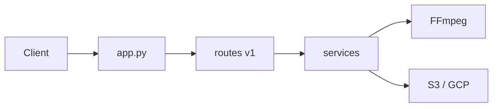

# stephengpope/no-code-architects-toolkit

> API Flask auto-hébergée de traitement média, pour automatiseurs no-code cherchant à remplacer des API payantes.

## Le problème
Transcoder, sous-titrer, transcrire ou concaténer des médias via des API SaaS facturées à l'usage alourdit les automatisations.

## Ce que ça fait vraiment
Une API REST Flask (routes `/v1/...`) expose conversion audio/vidéo, sous-titres, transcription, capture d'écran web via Playwright, exécution de code Python et envoi vers S3 ou Google Cloud Storage. Les routes délèguent à une couche de services qui pilote FFmpeg. Les traitements longs passent par un `webhook_url`.

## Comment c'est branché


## Essayer
```bash
docker build -t no-code-architects-toolkit .
docker run -d -p 8080:8080 \
  -e API_KEY=your_api_key \
  -e LOCAL_STORAGE_PATH=/tmp \
  -e MAX_QUEUE_LENGTH=10 \
  -e GUNICORN_WORKERS=4 \
  -e GUNICORN_TIMEOUT=300 \
  no-code-architects-toolkit
```

## Coût et pièges
Pas de licence à payer, mais l'hébergement est à ta charge (Digital Ocean plus cher, Cloud Run limité au-delà de 5 minutes). `API_KEY` est obligatoire ; les variables S3 ou GCP le sont si tu les utilises. Licence GPL-2.0.

## Ce que ce n'est pas
Pas un « 100 % gratuit » au sens strict : le calcul et le stockage sont facturés par ton hébergeur. Pas une interface no-code, c'est une API.

## Alternatives
Le README cite comme services remplacés : ChatGPT Whisper, Cloud Convert, Creatomate, JSON2Video, PDF.co, Placid.

## Pour toi
À surveiller : utile pour un pipeline média auto-hébergé, mais projet d'une seule personne sous GPL-2.0, à vérifier avant intégration commerciale.

