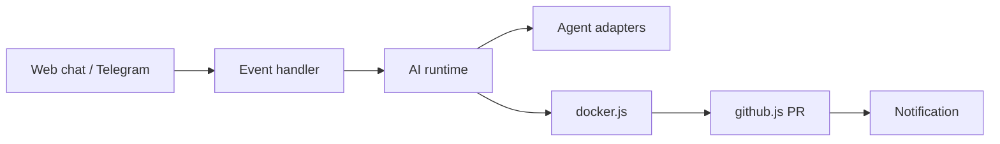

# stephengpope/thepopebot

> Agent personnel auto-hébergé : chat web et Telegram, ateliers de code et tâches de fond qui ouvrent des PR.

## Le problème
Orchestrer un agent de code qui travaille en arrière-plan sur tes dépôts, avec chat, terminal et notifications, demande beaucoup d'assemblage.

## Ce que ça fait vraiment
Un gestionnaire d'événements reçoit tes messages (web, Telegram), choisit un agent de code (Claude Code, Codex, Gemini, OpenCode, Pi, Kimi) et soit répond en direct, soit crée une branche `agent-job/<id>`, lance un conteneur Docker, ouvre une PR, l'auto-fusionne et te prévient. Espaces de code avec terminal navigateur, LLM d'aide séparé, cron et triggers, SQLite.

## Comment c'est branché


## Essayer
```bash
mkdir my-agent && cd my-agent
npx thepopebot@latest init
npm run setup
```

## Coût et pièges
Clés LLM à ta charge (ou jeton d'abonnement Claude), compte GitHub, Docker et ngrok pour un local. Sans limitation de débit ni TLS sur le saut local selon le README ; l'auto-fusion donne un pouvoir élevé à l'agent.

## Ce que ce n'est pas
Pas un produit sécurisé clé en main : le README décline la responsabilité de l'infrastructure.

## Alternatives
Aucune alternative nommée dans le README.

## Pour toi
À surveiller : idée intéressante d'agents asynchrones par PR, mais mono-mainteneur, jeune (2026) et auto-fusion à encadrer.

