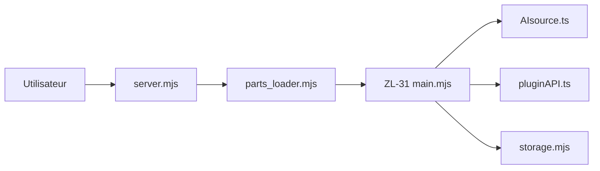

# steve02081504/fount

> Plateforme modulaire d'agents IA à personnaliser par le code : personnages, mondes, shells et sources d'IA.

## Le problème
Les frontends de chat LLM figent la logique de l'agent : on règle le prompt et l'interface, rarement le comportement.

## Ce que ça fait vraiment
Serveur Deno/Express qui charge des « parts » (chars, worlds, personas, shells, AIsources). Le chat résout un personnage, construit le prompt, appelle une source d'IA (code JS libre) puis passe les réponses dans des plugins. Les blocs de code envoyés sont exécutables en direct ; shells pour Telegram, Discord, navigateur, IDE ; P2P sur LAN. Le personnage par défaut ZL-31 pilote la configuration par conversation.

## Comment c'est branché


## Essayer
```bash
npx the-fount
docker pull ghcr.io/steve02081504/fount
fount remove
```

## Coût et pièges
Il faut configurer une API LLM (facturation à ta charge). Les personnages exécutent du JavaScript : le README prévient que des parts communautaires peuvent contenir du code malveillant.

## Ce que ce n'est pas
Pas un simple chat prêt à l'emploi : courbe d'apprentissage et code requis pour aller loin. La licence est présente mais non identifiée par GitHub. Migration des anciens personnages non supportée.

## Alternatives
- OpenClaw : pour essayer des agents sans personnalisation poussée.
- SillyTavern : si tu dépends de STscript ou de ses plugins.
- ChatGPT : pour simplement discuter.

## Pour toi
À surveiller : l'exécution de code tiers et la licence floue freinent un usage pro, mais l'idée de runtime d'agents programmable vaut un œil.

