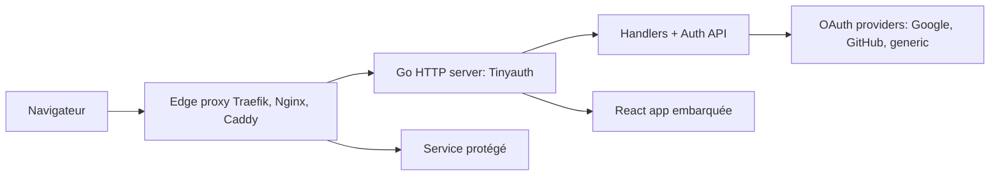

# steveiliop56/tinyauth

> Serveur d'authentification et d'autorisation minimal, en middleware devant vos applications ou en serveur autonome.

## Le problème
Protéger des applications auto-hébergées derrière un proxy inverse sans déployer une pile d'identité lourde.

## Ce que ça fait vraiment
Sert d'intermédiaire d'authentification pour Traefik, Nginx et Caddy, avec OAuth, LDAP et contrôles d'accès. La version 5.1.0 est certifiée OpenID (Basic OP) selon le README. D'après l'architecture décrite d'après le code : un serveur HTTP Go, une interface React embarquée, des fournisseurs Google, GitHub et génériques, TOTP et une CLI de gestion des utilisateurs. Aucune base externe n'est mentionnée par cette description.

## Comment c'est branché

## Essayer
Aucune commande documentée dans le README : il renvoie à la documentation en ligne et à un `docker-compose` de démonstration (Traefik, Whoami, Tinyauth). Une démo en ligne existe avec l'utilisateur `user` et le mot de passe `password`.

## Coût et pièges
Gratuit. Le README prévient que le projet est en développement actif et que la configuration change souvent : lire les notes de version avant chaque mise à jour. Le compose vit sur la branche de développement et peut être en avance sur la version stable. 48 issues ouvertes.

## Ce que ce n'est pas
Ce n'est pas un fournisseur d'identité complet de type annuaire. Ce n'est pas non plus figé : la configuration évolue d'une version à l'autre.

## Alternatives
Aucune alternative nommée dans le README.

## Pour toi
Surveiller : utile pour sécuriser des outils internes MLOps derrière un proxy, mais configuration instable, AGPL-3.0 et un seul mainteneur ; à retester quand la config se stabilise.

