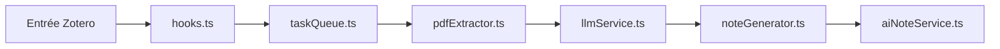

# steven-jianhao-li/zotero-AI-Butler

> Plugin Zotero qui fait lire et résumer les PDF par un LLM, pour les chercheurs qui accumulent des articles.

## Le problème
Les articles s'empilent dans Zotero sans être lus, et l'envoi manuel de chaque PDF à une IA est fastidieux. Les résumés oubliés obligent à tout relire.

## Ce que ça fait vraiment
Scanne les nouveaux PDF (option désactivée par défaut), les met en file d'attente et envoie le texte ou le PDF en Base64 au modèle configuré. Le résultat est rangé en note Markdown sous l'entrée Zotero. Annexes : lecture approfondie en plusieurs tours, revue de littérature multi-articles, carte mentale, « résumé en une image » (génération d'affiche), barre latérale avec chat et formules LaTeX. Prompts modifiables.

## Comment c'est branché


## Essayer
```bash
# Pas de ligne de commande : installation par fichier .xpi
# 1. Télécharger le .xpi depuis la page Releases du dépôt
# 2. Zotero > Outils > Plugins > glisser-déposer le .xpi
# 3. Configurer la clé d'API (Gemini recommandé) puis « Tester la connexion »
```
Aucune commande shell n'est documentée.

## Coût et pièges
Clé d'API à fournir (OpenAI, Gemini, Anthropic, compatible OpenAI, Volcengine, Ollama). Le README prévient que le résumé en image et le mode « tour multiples » consomment beaucoup de tokens ; l'auto-génération d'image est désactivée par défaut.

## Ce que ce n'est pas
Pas un service hébergé : aucun proxy de modèle n'est fourni. Les PDF partent chez le fournisseur choisi (sauf Ollama local). Le README est en chinois d'abord ; la qualité des notes dépend du modèle et des prompts.

## Alternatives
- zotero-ainote : projet dont le code a servi de référence, cité dans le README.

## Pour toi
À surveiller : utile si tu lis beaucoup d'articles dans Zotero et acceptes d'envoyer les PDF à une API ; licence AGPL et mainteneur unique à garder en tête.

