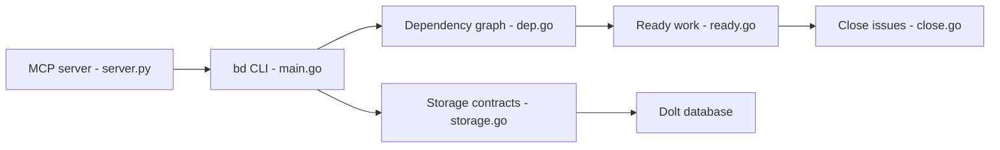

# steveyegge/beads

> Gestionnaire de tâches en graphe de dépendances, sur base Dolt, servant de mémoire persistante aux agents de code.

## Le problème
Les agents perdent le contexte sur les tâches longues quand le plan vit dans des fichiers Markdown.

## Ce que ça fait vraiment
La CLI `bd` crée des tâches (« beads ») avec identifiants par hachage, lie les dépendances, liste ce qui est débloqué (`bd ready`), permet de réclamer, fermer, stocker des souvenirs (`bd remember`) et compacter les anciennes tâches. Stockage Dolt embarqué ou serveur ; synchronisation par remotes Dolt ; un serveur MCP et une API HTTP existent aussi.

## Comment c'est branché


## Essayer
```bash
curl -fsSL https://raw.githubusercontent.com/gastownhall/beads/main/scripts/install.sh | bash
cd your-project
bd init
bd create "Title" -p 0
bd ready
bd update <id> --claim
bd close <id>
```

## Coût et pièges
Gratuit. `bd init` modifie `AGENTS.md` et installe des intégrations Claude/Codex sauf `--stealth` ou `--skip-agents`. Mise à jour : attention aux migrations de schéma sur bases distantes.

## Ce que ce n'est pas
Pas un outil de gestion de projet humain à la Jira. Les données ne sont pas dans `issues.jsonl`, qui n'est qu'un export.

## Alternatives
Aucune alternative nommée dans le README.

## Pour toi
À surveiller : utile si tu fais travailler des agents sur des chantiers longs, mais adoption coûteuse (Dolt, hooks) et projet dépendant d'une personne.

