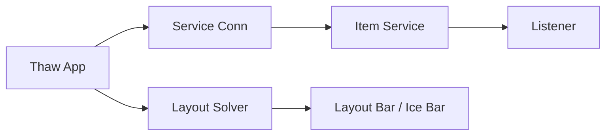

# stonerl/Thaw

> Dépôt déplacé : ancienne copie d'un gestionnaire de barre de menus macOS.

## Le problème
Le README ne dit que « This repository has moved to https://github.com/thaw-app/Thaw » ; le problème visé n'est pas documenté.

## Ce que ça fait vraiment
D'après le code : app macOS qui masque, affiche et réordonne les éléments de la barre de menus, avec un service helper `MenuBarItemService`, un moteur de disposition (`LayoutSolver`, `LayoutReconciler`), profils, raccourcis et hooks.

## Comment c'est branché

## Essayer
Aucune commande documentée ; le README renvoie vers `thaw-app/Thaw`.

## Coût et pièges
Aucune licence déclarée. Le dépôt vivant est ailleurs.

## Ce que ce n'est pas
Pas le dépôt à suivre : le README dit qu'il a déménagé.

## Alternatives
- thaw-app/Thaw : dépôt actuel indiqué par le README.

## Pour toi
Ignorer : copie déplacée, sans licence, et outil macOS de confort sans lien avec un travail data, IA ou MLOps.

