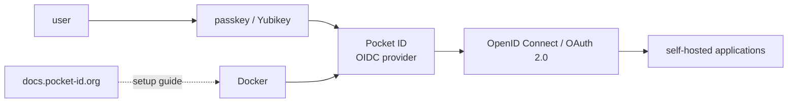

# stonith404/pocket-id

> **One sentence.** A self-hosted OpenID Connect and OAuth 2.0 provider where sign-in happens through passkeys only.

## The problem

Putting centralised sign-in in front of your self-hosted applications normally means running a
full identity provider. The README names Keycloak and ORY Hydra and says they are "often too
complex for simple use cases".

## What it actually does

Pocket ID is an OpenID Connect and OAuth 2.0 provider; the README states it is "OpenID Connect
Certified™". Applications delegate user sign-in to it. Its stated distinguishing point: it
supports **only** passkey authentication, so there is no password. The README gives the example
of using a physical Yubikey to sign in to all of your self-hosted services. A public demo runs
at demo.pocket-id.org. Everything else — configuration, operation — is deferred to the external
documentation at docs.pocket-id.org, which is not part of the README.

## How it is wired

No code-derived diagram exists for this repository, so this sketch is rebuilt from the README,
which names no internal file or component.

## Trying it

The README documents no command. It only says setup is possible in multiple ways, that the
"easiest and recommended way is to use Docker", and points to the setup guide in the online
documentation (docs.pocket-id.org). Nothing is reconstructed here.

## Cost and gotchas

The README announces neither a paid tier nor a hosted service: usage is self-hosted, so free
apart from the machine. Docker is needed for the recommended path. The main catch is
structural: passkey-only is a deliberate choice the README owns, noting that "some people might
not like this idea at first" — there is no password fallback. No license is declared in the
README and the catalogue does not record one, so check the repository before any company use.
Real operating concerns (database, reverse proxy, backups) are not described here and live in
the external documentation.

## What it is not

It is not a functional replacement for Keycloak: the README claims simplicity over coverage,
not parity. It is not a password manager nor a corporate directory, and it is not a SaaS —
demo.pocket-id.org is a demo, not a service to build on. It is also unusable without passkeys:
no other authentication factor is offered, which rules out users or fleets that do not have any.

## Alternatives

- **Keycloak** (named in the README): a full OIDC provider, preferable when you need
  federation, fine-grained roles or LDAP connectors — at the cost of complexity.
- **ORY Hydra** (named in the README): an OAuth 2.0 / OIDC server meant to be embedded into an
  existing architecture, preferable when identities are already managed elsewhere.

## Why it matters to you

Side interest for a data / AI / MLOps profile: this is the authentication brick you put in
front of a self-hosted lab (notebooks, MLflow, dashboards) instead of shared passwords. Worth
watching rather than adopting right away, given the undeclared license and a project carried by
a personal account.
