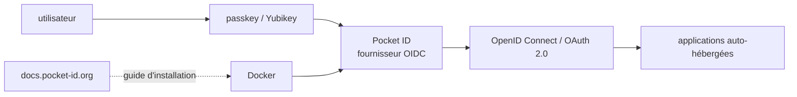

# stonith404/pocket-id

> **Une phrase.** Fournisseur OpenID Connect et OAuth 2.0 auto-hébergé où l'on se connecte uniquement par passkey.

## Le problème

Sans lui, pour mettre de l'authentification centralisée devant ses services auto-hébergés, il
faut déployer un fournisseur OIDC complet. Le README cite Keycloak et ORY Hydra et les juge
« souvent trop complexes pour des cas d'usage simples ».

## Ce que ça fait vraiment

Pocket ID est un fournisseur OpenID Connect et OAuth 2.0 ; le README indique qu'il est
« OpenID Connect Certified™ ». Les applications tierces lui délèguent la connexion des
utilisateurs. Sa particularité annoncée : il ne prend en charge **que** l'authentification par
passkey — pas de mot de passe. Le README donne l'exemple d'une clé physique Yubikey servant à
se connecter à l'ensemble de ses services auto-hébergés. Une démo publique est ouverte sur
demo.pocket-id.org. Tout le reste (configuration, exploitation) est renvoyé à la documentation
externe docs.pocket-id.org, non incluse dans le README.

## Comment c'est branché

Aucun diagramme tiré du code n'existe pour ce dépôt : ce schéma est reconstruit depuis le
README, qui ne nomme aucun fichier ni composant interne.

## Essayer

Aucune commande n'est documentée dans le README. Il indique seulement que l'installation peut
se faire de plusieurs manières, que la voie « la plus simple et recommandée » est Docker, et
renvoie au guide de la documentation en ligne (docs.pocket-id.org). Rien n'est reconstruit ici.

## Coût et pièges

Le README n'annonce ni offre payante ni service hébergé : l'usage est auto-hébergé, donc
gratuit hors coût de la machine. Il faut Docker pour la voie recommandée. Piège principal : le
choix du tout-passkey est structurel, le README le présente comme assumé et note que « certaines
personnes pourraient ne pas aimer cette idée au départ » — pas de repli mot de passe. Aucune
licence n'est déclarée dans le README, et le catalogue ne la renseigne pas : à vérifier dans le
dépôt avant tout usage en entreprise. Les paramètres réels (base de données, reverse proxy,
sauvegarde) ne sont pas décrits ici et vivent dans la documentation externe.

## Ce que ce n'est pas

Ce n'est pas un remplaçant fonctionnel de Keycloak : le README revendique la simplicité contre
la couverture, pas la parité. Ce n'est pas un gestionnaire de mots de passe ni un annuaire
d'entreprise, et ce n'est pas un SaaS — demo.pocket-id.org est une démo, pas un service à
utiliser en production. Ce n'est pas non plus utilisable sans passkey : aucun autre facteur
d'authentification n'est proposé, ce qui exclut les utilisateurs ou parcs qui n'en ont pas.

## Alternatives

- **Keycloak** (cité par le README) : fournisseur OIDC complet, à préférer si l'on a besoin de
  fédération, de rôles fins, de connecteurs LDAP — au prix de la complexité.
- **ORY Hydra** (cité par le README) : serveur OAuth 2.0 / OIDC destiné à être intégré dans une
  architecture existante, à préférer quand on gère déjà ses identités ailleurs.

## Pour toi

Intérêt latéral pour un profil data / IA / MLOps : c'est la brique d'authentification qu'on
place devant un lab auto-hébergé (notebooks, MLflow, dashboards) pour éviter les mots de passe
partagés. À surveiller plutôt qu'à adopter tout de suite, faute de licence déclarée et avec un
projet porté par un compte personnel.
