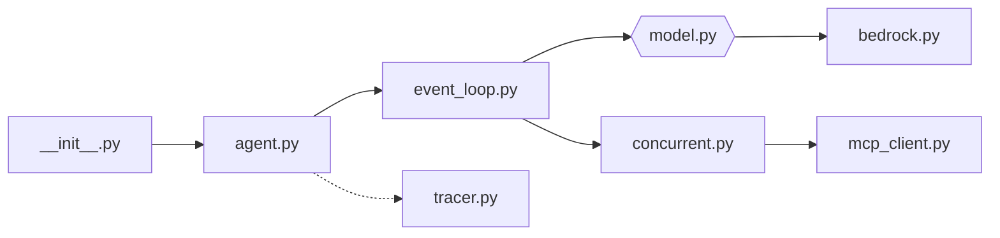

# strands-agents/harness-sdk

> SDK Python et TypeScript pour construire des agents IA sans écrire sa propre boucle d'agent.

## Le problème
Une boucle d'agent faite maison grossit vite : limites de tours, budgets de tokens, annulation, outils, MCP, mémoire, traces, multi-agents. Tout se réécrit à la main.

## Ce que ça fait vraiment
Monorepo : SDK Python (`strands-py`), SDK TypeScript (`strands-ts`), « harness » préassemblé (`create_harness()`), CLI, site de doc, serveur MCP de documentation.
Un `Agent` pilote une boucle modèle/outils ; fournisseurs derrière une abstraction commune (Bedrock par défaut, Anthropic, OpenAI, Gemini, Ollama…).
Outils exécutés en séquence ou en concurrence, isolables dans une sandbox locale, Docker ou SSH ; client MCP intégré.
Hooks et middleware à chaque étape, gestion du contexte, sessions (fichiers, S3), graphes, swarm, A2A, traces.

## Comment c'est branché


## Essayer
```bash
pip install strands-harness
pip install strands-agents strands-agents-tools
npm install @strands-agents/harness
npm install @strands-agents/sdk
```

## Coût et pièges
Python 3.10+ ou Node.js 22+. Le fournisseur par défaut est Amazon Bedrock : sans compte AWS, configurer un autre fournisseur. Les appels aux modèles sont à ta charge.

## Ce que ce n'est pas
Pas une plateforme hébergée : tout tourne dans ton processus, sans control plane.
Pas un produit fini : le harness fournit des valeurs par défaut, le reste se câble soi-même.
Les agents audio bidirectionnels (Gemini Live, Nova Sonic, OpenAI Realtime) restent expérimentaux côté Python.

## Alternatives
Aucune alternative nommée dans le README.

## Pour toi
Candidat sérieux si tu allais écrire ta propre boucle d'agent en Python, surtout sur Bedrock ; à comparer avant d'adopter.
