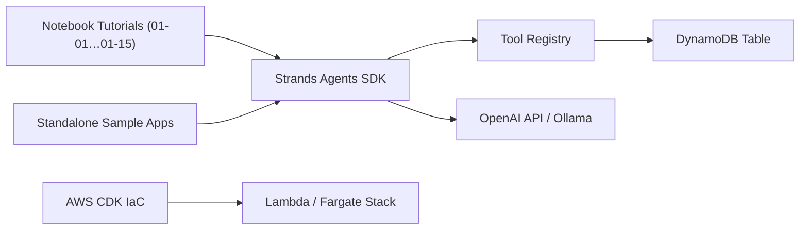

# strands-agents/samples

> Exemples et tutoriels pour construire des agents avec le SDK Strands Agents, en Python et TypeScript.

## Le problème
Prendre en main un SDK d'agents sans exemples exécutables ni parcours d'apprentissage est lent.

## Ce que ça fait vraiment
Dépôt de démonstrations. Côté Python : `01-learn` (bases, multi-agents, streaming), `02-deploy` (Lambda, Fargate, AgentCore), `03-integrate`, `04-industry-use-cases`, `05-technical-use-cases` (RAG agentique), `06-evaluate`, `07-ux-demos`, `08-edge`. Côté TypeScript : `01-learn` et `02-deploy`. Tout dépend du SDK Strands, installé séparément.

## Comment c'est branché


## Essayer
```bash
python -m venv venv
source venv/bin/activate
pip install strands-agents strands-agents-tools
npm install @strands-agents/sdk
```

## Coût et pièges
Python 3.10+ (Node 18+ pour TypeScript). Il faut configurer un fournisseur de modèle ; les exemples de déploiement supposent un compte AWS (Lambda, Fargate, DynamoDB), avec facturation à votre charge.

## Ce que ce n'est pas
Pas du code pour la production : le README le dit, sécurité et tests à refaire. Ce n'est pas le SDK lui-même.

## Alternatives
Aucune alternative citée dans le README.

## Pour toi
À surveiller comme bibliothèque d'exemples si tu évalues Strands ; peu d'intérêt sinon, car ce n'est qu'un dépôt d'exemples.
