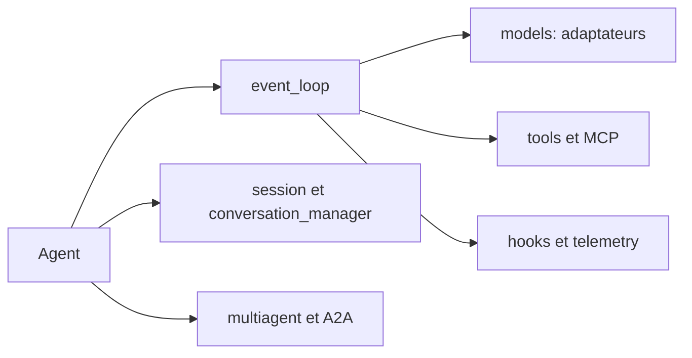

# strands-agents/sdk-python

> SDK Python et TypeScript pour construire des agents IA pilotés par le modèle, sans plan de contrôle hébergé.

## Le problème
Écrire sa propre boucle d'agent oblige à réinventer limites de tours, budgets de tokens, outils, sessions et traçage.

## Ce que ça fait vraiment
La boucle d'agent tourne dans ton processus : outils et sortie structurée, MCP, multi-agents (graphe, essaim, A2A), mémoire et sessions (fichier, S3), traçage, garde-fous, évaluations. Adaptateurs pour Bedrock (par défaut), Anthropic, OpenAI, Gemini, Ollama et d'autres. Des modules expérimentaux couvrent le streaming bidirectionnel et le pilotage (steering).

## Comment c'est branché


## Essayer
```bash
pip install strands-agents strands-agents-tools
```
```python
from strands import Agent
from strands_tools import calculator
agent = Agent(tools=[calculator])
agent("What is the square root of 1764")
```

## Coût et pièges
Le fournisseur par défaut est Amazon Bedrock : identifiants AWS et accès aux modèles Claude Sonnet à activer. Python 3.10+, Node 22+ pour le SDK TypeScript.

## Ce que ce n'est pas
Pas une plateforme d'exécution hébergée. Les modules `experimental/` (bidi, steering, checkpoint) n'ont pas de contrat stable.

## Alternatives
Aucune alternative nommée dans le README.

## Pour toi
À adopter : base sobre pour agents en Python avec traçage intégré et choix libre du modèle ; licence non déclarée à confirmer.
