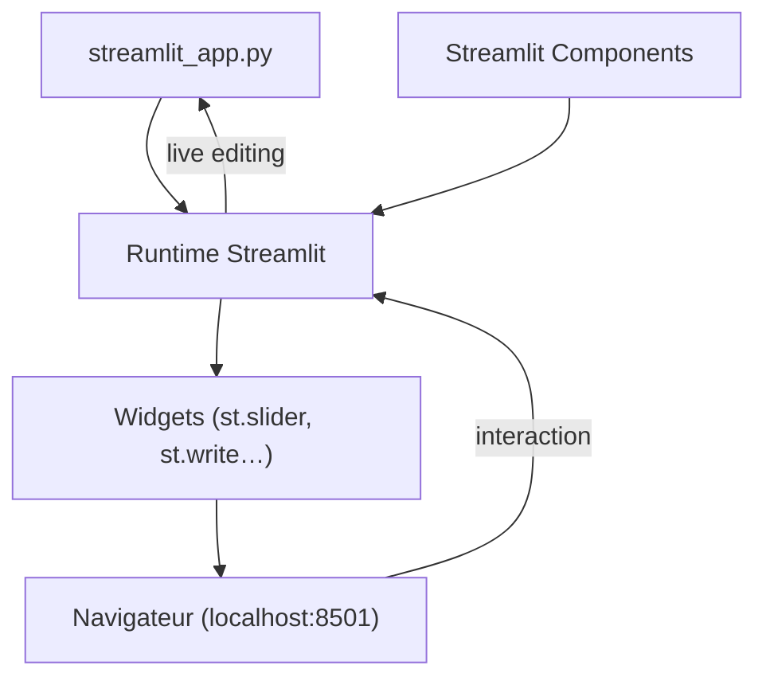

# streamlit/streamlit

> Bibliothèque Python qui transforme un script en application web interactive, sans front.

## Le problème
Montrer un modèle ou un jeu de données à quelqu'un impose sinon d'écrire du HTML, du JavaScript
et de gérer un hébergement, pour une démo qui vivra deux semaines.

## Ce que ça fait vraiment
Exécute un script Python de haut en bas et rend chaque appel `st.*` comme un élément de page ;
le script est rejoué à chaque interaction. Fournit widgets de saisie, dataframes, graphiques,
mise en page et applications multi-pages.
Recharge l'application à chaque enregistrement du fichier. Les Streamlit Components permettent
d'étendre le catalogue d'éléments.

## Comment c'est branché


## Essayer
```bash
pip install streamlit
streamlit hello
streamlit run streamlit_app.py
```

## Coût et pièges
Gratuit. Community Cloud est proposé pour déployer et partager, hébergé par l'éditeur, donc
dépendance à un service tiers si tu l'utilises. Les pull requests extérieures sont suspendues :
tu peux rapporter des bugs, pas contribuer du code à l'amont.

## Ce que ce n'est pas
Ce n'est pas un framework web généraliste : le modèle « on rejoue tout le script » cadre ce qu'on
peut y faire. Ce n'est pas un outil de mise en production d'un modèle, plutôt une vitrine.
Ce n'est pas une bibliothèque graphique : les graphiques viennent d'ailleurs.

## Alternatives
Aucune alternative nommée dans le README (seul `streamlit-extras`, une extension, est cité).

## Pour toi
Le chemin le plus court entre un notebook et quelque chose qu'un métier peut cliquer.
