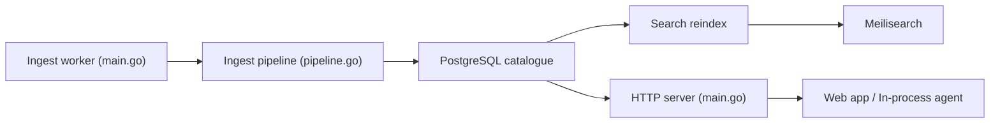

# strelov1/freehire

> Catalogue ouvert d'offres IT crawlées depuis les sites carrières, avec CV, suivi de candidature et agent.

## Le problème
Les offres d'emploi sont dupliquées, republiées par des intermédiaires et souvent périmées.

## Ce que ça fait vraiment
Des workers Go ponctuels crawlent 225 sources (ATS comme Workday ou Greenhouse, agrégateurs, sites carrières) et normalisent les offres dans Postgres avec dédoublonnage ; Meilisearch fournit la recherche à facettes. Par-dessus : constructeur de CV, score CV / offre, analyse par LLM, tableau de candidatures, boîte mail liée, agent, API publique sans clé, CLI, serveur MCP et extension Chrome.

## Comment c'est branché


## Essayer
```bash
make up
curl localhost:8080/health
curl localhost:8080/api/v1/jobs
go run ./cmd/ingest greenhouse
```

## Coût et pièges
Pile lourde : api, web, postgres, meilisearch, redis, minio. `JWT_SECRET` obligatoire. Les fonctions IA demandent un endpoint LLM à votre charge. Les chiffres (3,3 M d'offres) sont ceux du site hébergé, pas de votre instance.

## Ce que ce n'est pas
Pas une source garantie sans doublons : la qualité dépend des adaptateurs et des dictionnaires de facettes. Le crawl de sites tiers relève de leurs conditions d'usage, non discutées.

## Alternatives
Aucune alternative citée dans le README.

## Pour toi
À surveiller : l'API publique sans clé et le pipeline d'ingestion Go servent de source de données d'offres ou d'exemple de pipeline, mais le projet est tenu par une seule personne.
