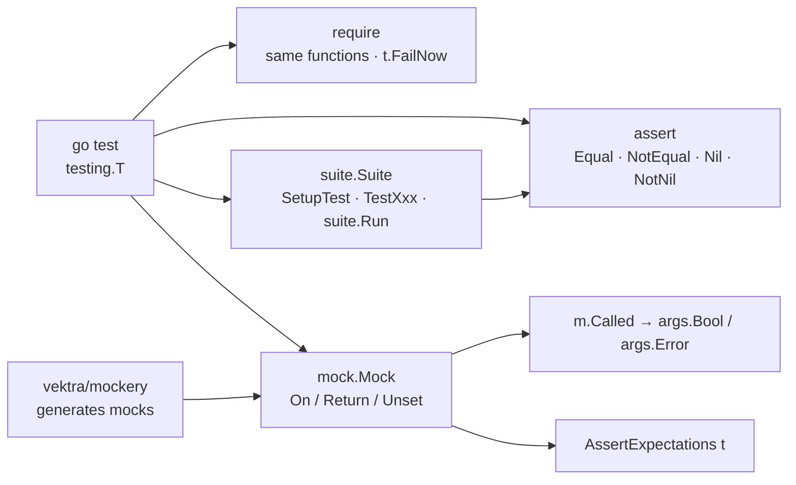

# stretchr/testify

> **Assertions, mocks and suites for Go tests, frozen at v1 and layered on top of `testing`.**

## The problem

Go's standard `testing` package ships no assertions and no test doubles. You write
`if got != want { t.Errorf(...) }` by hand, format the failure message yourself, and comparing
two structs or slices means reaching for `reflect.DeepEqual`, which tells you that they differ
but not where. For external dependencies you hand-write a type implementing the interface and
record the calls yourself.

## What it actually does

Testify is a set of four Go packages that sit alongside `go test` rather than replacing it.

- `assert`: functions such as `assert.Equal(t, 123, 123, "they should be equal")`,
  `assert.NotEqual`, `assert.Nil`, `assert.NotNil`. Each takes the `*testing.T` as its first
  argument — that is how failures are reported — accepts an optional annotation message, and
  **returns a bool** so you can guard further assertions on the result. `assert.New(t)` returns
  a bound variant where `t` no longer has to be passed on every call.
- `require`: the same functions, but they **stop the test** instead of returning a bool
  (`t.FailNow`). The README notes they must be called from the goroutine running the test, not
  from goroutines it spawns, or race conditions may occur.
- `mock`: embed `mock.Mock` in a struct, have the stubbed method call `m.Called(...)` and read
  results back with `args.Bool(0)`, `args.Error(1)`. Expectations are set with
  `testObj.On("DoSomething", 123).Return(true, nil)`, checked with
  `testObj.AssertExpectations(t)`, accept the `mock.Anything` placeholder for arguments that
  cannot be predicted, and can be removed with `mockCall.Unset()` to install another.
- `suite`: a struct embedding `suite.Suite` becomes a test suite; `SetupTest` and friends act
  as setup, methods prefixed with `Test` are the tests, and an ordinary `go test` function runs
  the lot via `suite.Run(t, new(ExampleTestSuite))`. The `Suite` object carries the assertion
  methods itself (`suite.Equal(...)`).

## How it is wired



No code-derived diagram exists for this repository: this one is reconstructed from the README
alone. The structural point is that everything starts from `testing.T` and returns to it —
testify has no runner of its own, and failures go out through the normal `go test` machinery.

## Trying it

```bash
go get github.com/stretchr/testify
```

The packages this makes available, as listed by the README:

```
github.com/stretchr/testify/assert
github.com/stretchr/testify/require
github.com/stretchr/testify/mock
github.com/stretchr/testify/suite
github.com/stretchr/testify/http (deprecated)
```

The import template given in the README:

```go
package yours

import (
	"testing"

	"github.com/stretchr/testify/assert"
)

func TestSomething(t *testing.T) {
	assert.True(t, true, "True is true!")
}
```

Updating: `go get -u github.com/stretchr/testify`. To refresh the generated files (those marked
`Code generated with`): `go generate ./...`.

## Cost and traps

- **The repository is frozen at v1.** The note at the top of the README says so: no breaking
  changes will be accepted, and v2 is deferred to an open discussion (#1560). That is a
  stability guarantee for existing users, and the reason for the flag: the API will not move
  any more, and neither will its design flaws.
- **`suite` does not support parallel tests** — a warning callout in the README, issue #934. If
  your test strategy relies on `t.Parallel()`, the `suite` package is out.
- **`require` from a goroutine is a race.** The README states it explicitly: `FailNow` must be
  called from the test's goroutine. A classic trap when testing concurrent code.
- **The `http` package is marked deprecated** in the installation listing itself.
- **Go versions**: "the most recent major Go versions from 1.19 onward". No upper bound is
  announced, but nothing below 1.19 is supported.
- **Common misuse**: the README points to `testifylint`, run through `golangci-lint`, to catch
  it — a signal that the API lends itself to silent mistakes (expected/actual swapped,
  `assert` used where `require` is needed).
- Financial cost is nil: MIT, no service, no account, no key.

## What it is not

- **It is not a test runner** and not a replacement for `go test`. There is no binary, no
  report format, no configuration: you import packages and keep running `go test`.
- **It is not a BDD framework.** No `Describe`/`It`, no DSL; `suite` reproduces the
  class-style suite of object-oriented languages, with setup and teardown, and nothing more.
- **`mock` generates nothing.** You write the mocked struct and its methods by hand; it is
  `mockery`, the third-party tool the README cites, that produces that code from an interface.
- **It is not an evolving framework**: see the v1 freeze. Anyone waiting for new features will
  wait forever; what is missing today will still be missing tomorrow.
- **`assert` does not stop the test**: a failed assertion lets the function carry on with
  invalid values. That is what `require` is for, and confusing the two is the most common
  misunderstanding.

## Alternatives

| | When to prefer it |
|---|---|
| **vektra/mockery** | Named in the README and present among the catalogue neighbours. Complementary rather than competing: it generates mock code against an interface, and that code then builds on testify's `mock`. Worth adding as soon as the number of interfaces to double makes hand-writing tedious. |
| **Antonboom/testifylint** | Named in the README, recommended via `golangci-lint`. Not an alternative: the guardrail that catches misuse of testify. Install it alongside testify, not instead of it. |
| **onsi/ginkgo** | A catalogue neighbour, and the only genuine alternative in the list: a BDD testing framework for Go with its own writing style and runner. Prefer it if you want structured specifications and parallel tests; prefer testify to stay close to plain `go test`. |

The remaining neighbours are not comparable: `testcontainers/testcontainers-go` spins up
containers for integration tests (orthogonal to assertions) and `evilmartians/lefthook` is a
git hook manager.

## For you

Adopt it without reservation in any Go code you test: it is the most ordinary test dependency
in the ecosystem, MIT-licensed, with no service and no account, and its v1 freeze makes it a
dependency that will never demand a migration. For a data/MLOps profile, it is what makes the
tests of an inference service or a Go collector readable, and `mock` avoids wiring a real
object store or database into unit tests. One discipline to hold from day one: `require` for
preconditions, `assert` for checks, and `testifylint` in CI.
