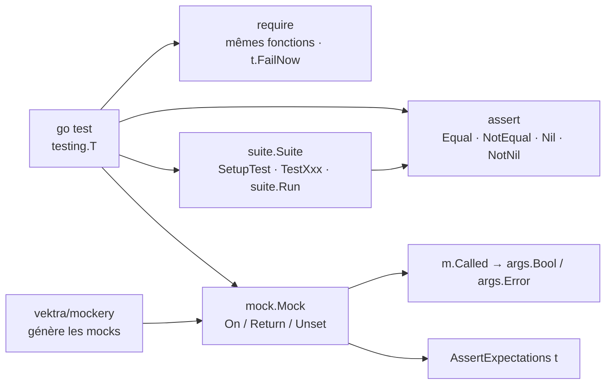

# stretchr/testify

> **Assertions, mocks et suites pour les tests Go, gelés en v1 et posés sur `testing`.**

## Le problème

La bibliothèque `testing` de Go ne fournit ni assertion ni double de test : on écrit
`if got != want { t.Errorf(...) }` à la main, on formate soi-même le message d'échec, et
comparer deux structures ou deux slices demande de passer par `reflect.DeepEqual` sans que
l'échec dise où est la différence. Pour les dépendances externes, il faut écrire à la main un
type qui implémente l'interface et enregistrer les appels.

## Ce que ça fait vraiment

Testify est un ensemble de quatre paquets Go qui s'ajoutent à `go test` sans le remplacer.

- `assert` : des fonctions du genre `assert.Equal(t, 123, 123, "they should be equal")`,
  `assert.NotEqual`, `assert.Nil`, `assert.NotNil`. Chacune prend le `*testing.T` en premier
  argument — c'est par lui que l'échec est signalé — accepte un message d'annotation
  facultatif, et **renvoie un booléen** qui permet de conditionner les assertions suivantes.
  `assert.New(t)` donne une variante liée à `t`, où l'on n'a plus à le repasser à chaque appel.
- `require` : les mêmes fonctions, mais qui **arrêtent le test** au lieu de renvoyer un
  booléen (`t.FailNow`). Le README précise qu'elles doivent être appelées depuis la goroutine
  du test, pas depuis une goroutine créée par lui, sous peine de course.
- `mock` : on embarque `mock.Mock` dans une structure, la méthode stub appelle `m.Called(...)`
  et relit le résultat via `args.Bool(0)`, `args.Error(1)`. Les attentes se posent avec
  `testObj.On("DoSomething", 123).Return(true, nil)`, se vérifient avec
  `testObj.AssertExpectations(t)`, acceptent le joker `mock.Anything` pour les arguments non
  prédictibles, et se retirent avec `mockCall.Unset()` pour en poser une autre.
- `suite` : une structure qui embarque `suite.Suite` devient une suite ; les méthodes
  `SetupTest` et consorts servent de préparation, les méthodes préfixées `Test` sont les tests,
  et une fonction `go test` normale lance le tout avec `suite.Run(t, new(ExampleTestSuite))`.
  L'objet `Suite` porte lui-même les méthodes d'assertion (`suite.Equal(...)`).

## Comment c'est branché



Aucun diagramme tiré du code n'existe pour ce dépôt : ce schéma est reconstruit depuis le seul
README. Le point structurant est que tout part de `testing.T` et y retourne — testify n'a pas
de lanceur à lui, les échecs passent par les capacités normales de `go test`.

## Essayer

```bash
go get github.com/stretchr/testify
```

Les paquets alors disponibles, listés par le README :

```
github.com/stretchr/testify/assert
github.com/stretchr/testify/require
github.com/stretchr/testify/mock
github.com/stretchr/testify/suite
github.com/stretchr/testify/http (deprecated)
```

Le gabarit d'import donné par le README :

```go
package yours

import (
	"testing"

	"github.com/stretchr/testify/assert"
)

func TestSomething(t *testing.T) {
	assert.True(t, true, "True is true!")
}
```

Mise à jour : `go get -u github.com/stretchr/testify`. Pour régénérer les fichiers produits par
génération de code (ceux marqués `Code generated with`) : `go generate ./...`.

## Coût et pièges

- **Le dépôt est gelé en v1.** L'encart en tête du README l'annonce : aucun changement cassant
  ne sera accepté, et la v2 est renvoyée à une discussion ouverte (#1560). C'est une garantie
  de stabilité pour qui l'utilise déjà, et la raison de l'alerte : l'API ne bougera plus, les
  défauts de conception non plus.
- **`suite` ne supporte pas les tests parallèles** — encart d'avertissement du README, issue
  #934. Si la stratégie de test repose sur `t.Parallel()`, le paquet `suite` est hors jeu.
- **`require` depuis une goroutine = course.** Le README le dit explicitement : `FailNow` doit
  être appelé depuis la goroutine du test. Piège classique dans les tests de code concurrent.
- **Le paquet `http` est marqué deprecated** dans la liste d'installation elle-même.
- **Versions de Go** : « the most recent major Go versions from 1.19 onward ». Pas de borne
  haute annoncée, mais pas de support en dessous de 1.19.
- **Mauvais usages fréquents** : le README renvoie à `testifylint`, à passer via
  `golangci-lint`, pour les attraper — signal que l'API se prête aux erreurs silencieuses
  (arguments attendu/obtenu inversés, `assert` là où `require` s'impose).
- Coût financier nul : MIT, pas de service, pas de compte, pas de clé.

## Ce que ce n'est pas

- **Ce n'est pas un lanceur de tests** et pas un remplaçant de `go test`. Il n'y a pas de
  binaire, pas de format de rapport, pas de configuration : on importe des paquets et on
  continue à lancer `go test`.
- **Ce n'est pas un cadre BDD.** Pas de `Describe`/`It`, pas de DSL ; `suite` reproduit le
  style suite de classe des langages objet, avec préparation et démontage, rien de plus.
- **`mock` ne génère rien.** On écrit la structure mockée et ses méthodes à la main ; c'est
  `mockery`, outil tiers cité par le README, qui produit ce code depuis une interface.
- **Ce n'est pas un cadre en évolution** : voir le gel v1. Qui attend de nouvelles
  fonctionnalités attend en vain ; ce qui manque aujourd'hui manquera demain.
- **`assert` n'arrête pas le test** : une assertion fausse laisse la fonction continuer avec
  des valeurs invalides. C'est `require` qu'il faut, et la confusion entre les deux est le
  malentendu le plus courant.

## Alternatives

| | Quand le préférer |
|---|---|
| **vektra/mockery** | Nommé dans le README et présent dans les voisins du catalogue. Complémentaire plutôt que concurrent : il génère automatiquement le code de mock contre une interface, code qui s'appuie ensuite sur `mock` de testify. À prendre dès que le nombre d'interfaces à doubler rend l'écriture manuelle pénible. |
| **Antonboom/testifylint** | Nommé dans le README, recommandé via `golangci-lint`. Pas une alternative : le garde-fou qui attrape les mauvais usages de testify. À installer en même temps que testify, pas à la place. |
| **onsi/ginkgo** | Voisin du catalogue, et la seule vraie alternative de la liste : cadre de test BDD pour Go, avec son propre style d'écriture et son lanceur. À préférer si l'on veut des spécifications structurées et des tests parallèles ; testify à préférer pour rester au plus près de `go test`. |

Les autres voisins ne sont pas comparables : `testcontainers/testcontainers-go` lance des
conteneurs pour les tests d'intégration (question orthogonale aux assertions) et
`evilmartians/lefthook` est un gestionnaire de hooks git.

## Pour toi

À adopter sans réserve dans tout code Go qu'on teste : c'est la dépendance de test la plus
banale de l'écosystème, MIT, sans service ni compte, et son gel en v1 en fait une dépendance
qui ne demandera aucune migration. Pour un profil data / MLOps, c'est ce qui rend lisibles les
tests d'un service d'inférence ou d'un collecteur écrit en Go, et `mock` évite de brancher un
vrai stockage objet ou une vraie base dans les tests unitaires. Une seule discipline à tenir
dès le premier jour : `require` pour les préconditions, `assert` pour les vérifications, et
`testifylint` dans la CI.
