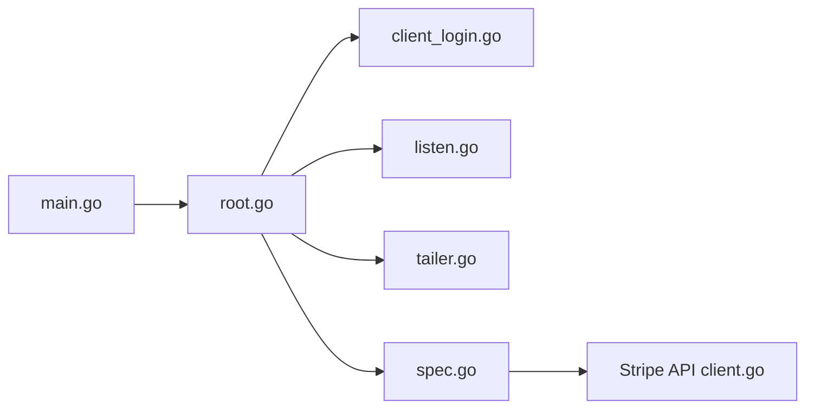

# stripe/stripe-cli

> CLI officielle de Stripe pour tester webhooks, suivre les journaux d'API et manipuler les objets du compte.

## Le problème
Tester une intégration Stripe en local suppose de recevoir des webhooks et de consulter les requêtes sans outil tiers.

## Ce que ça fait vraiment
Commandes : `login` (OAuth par appareil), `listen` (redirige les événements vers un endpoint local), `trigger` et `events resend`, `logs tail`, `get`/`post`/`delete` et commandes par ressource générées depuis la spécification d'API. Profils et identifiants dans un trousseau. Prise en charge d'un bac à sable, de plugins et de compétences d'agent.

## Comment c'est branché


## Essayer
```sh
npm install -g @stripe/cli
stripe login
stripe listen
stripe trigger
stripe logs tail
```

## Coût et pièges
Gratuit, compte Stripe requis. Le mode live en Docker impose une configuration pass/gpg. Un antivirus peut signaler le binaire à tort (issue 692). Télémétrie activée.

## Ce que ce n'est pas
Pas un SDK ni un substitut du tableau de bord. Les ressources dépendent de la spécification d'API publiée.

## Alternatives
Aucune alternative nommée dans le README.

## Pour toi
À surveiller : indispensable si tu branches des paiements Stripe, sinon sans objet pour ton travail data.

