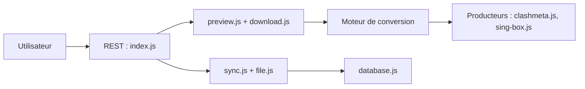

# sub-store-org/Sub-Store

> Gestionnaire de souscriptions proxy : convertit, filtre et regroupe des listes pour clients réseau.

## Le problème
Les listes de nœuds proxy existent en formats différents selon le client ; les convertir et les nettoyer à la main est fastidieux.

## Ce que ça fait vraiment
Un backend REST qui normalise des entrées proxy et les convertit vers des formats cibles (Clash.Meta, sing-box, URI, QX, Loon, Surge, Stash). Il filtre (regex, région, type), renomme, trie, résout les domaines, applique des scripts, regroupe plusieurs souscriptions et synchronise des artefacts.

## Comment c'est branché


## Essayer
```bash
pnpm i
SUB_STORE_BACKEND_API_PORT=3000 pnpm esbuild:dev
pnpm bundle:esbuild
```

## Coût et pièges
Gratuit. Un avis de sécurité du README signale que `sub.store` n'appartient pas au projet : risque de fuite de données si la réécriture échoue. Le README contient aussi une publicité pour une API tierce.

## Ce que ce n'est pas
Pas un VPN ni un fournisseur de proxy : il ne fait que traiter des listes. Licence AGPL-3.0 (copyleft fort).

## Alternatives
- Aucune alternative nommée dans le README.

## Pour toi
À ignorer : outil de gestion de proxys sans lien avec data/IA/MLOps, et avec un point de vigilance sur le domaine.

