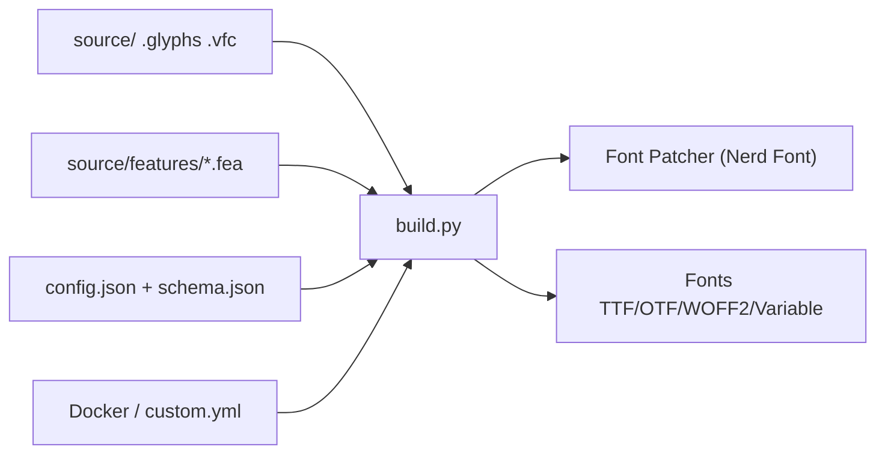

# subframe7536/maple-font

> Police monospace open source avec ligatures et variantes Nerd Font, pour développeurs qui veulent un terminal soigné.

## Le problème
Les polices de code par défaut manquent de ligatures cohérentes, d'icônes de terminal et de support CJK aligné en 2:1. Assembler ces trois choses soi-même est fastidieux.

## Ce que ça fait vraiment
Fournit une police à poids variable (V7) avec italiques cursives, ligatures configurables et déclinaisons TTF, OTF, WOFF2, Nerd Font (NF) et chinois/japonais (CN). Un script Python `build.py` pilote par `config.json` la génération de variantes sur mesure : largeur, features gelées, préréglage `--normal`. Attention : la branche décrite est un instantané figé de V7, V8 vit dans la branche `variable`.

## Comment c'est branché


## Essayer
```bash
brew install --cask font-maple-mono-nf
scoop install Maple-Mono-NF
git clone https://github.com/subframe7536/maple-font --depth 1 -b variable
pip install -r requirements.txt
python build.py
```

## Coût et pièges
Gratuit. La version CN télécharge des polices de base d'environ 111 Mo ; l'instanciation depuis la variable prend 10 à 30 minutes. Choisir entre versions hinted et unhinted selon la résolution d'écran.

## Ce que ce n'est pas
Ce n'est pas un outil de data science : c'est du confort d'éditeur. La branche par défaut est gelée sur V7, pas la dernière version. Les CN ne sont pas reconnues comme monospace si l'option `cn.narrow` est utilisée.

## Alternatives
- JetBrains Mono : préréglage `--normal` s'en inspire, plus sobre.
- Fira Code : source des ligatures de flèches infinies.
- Commit Mono : autre police de code citée dans les crédits.

## Pour toi
Surveiller : agréable pour un terminal ou un notebook, sans enjeu pour un profil data/MLOps, à installer en une commande si l'esthétique t'importe.

