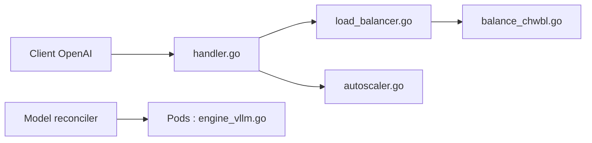

# substratusai/kubeai

> Opérateur Kubernetes avec proxy compatible OpenAI pour déployer et mettre à l'échelle des modèles d'IA.

## Le problème
Servir plusieurs réplicas de vLLM derrière un Service Kubernetes standard donne de mauvaises performances, car le cache KV n'est pas sans état.

## Ce que ça fait vraiment
Un proxy expose les endpoints OpenAI (chat, completions, embeddings, rerank, transcription) avec équilibrage sensible aux préfixes, mise en file pendant la montée depuis zéro et reprises. L'opérateur réconcilie une ressource Model en Pods vLLM, Ollama, FasterWhisper ou Infinity, gère cache de modèles, adaptateurs LoRA et autoscaling. Pas besoin d'Istio, Knative ni de l'adaptateur Prometheus.

## Comment c'est branché


## Essayer
```bash
kind create cluster
helm repo add kubeai https://www.kubeai.org
helm repo update
helm install kubeai kubeai/kubeai --wait --timeout 10m
helm install kubeai-models kubeai/models -f ./kubeai-models.yaml
kubectl port-forward svc/open-webui 8000:80
```

## Coût et pièges
Cluster Kubernetes requis ; GPU pour les gros modèles (CPU possible pour les petits). Le canal Discord est archivé ; 121 issues ouvertes.

## Ce que ce n'est pas
Pas un moteur d'inférence : il orchestre vLLM et autres. Pas un service managé.

## Alternatives
Aucune alternative nommée dans le README.

## Pour toi
À adopter si tu sers des LLM sur Kubernetes : routage sensible au cache KV et mise à l'échelle depuis zéro sans dépendances lourdes, actif depuis 2023.

