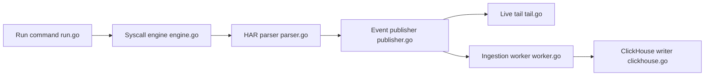

# subtrace/subtrace

> Outil en ligne de commande qui inspecte les requêtes HTTP d'un serveur lancé sous `subtrace run`.

## Le problème
Voir les requêtes HTTP qu'un serveur reçoit ou émet exige un proxy, un mitm ou des modifications du code.

## Ce que ça fait vraiment
Le README est très court. D'après le code : `subtrace run` intercepte les appels système réseau du processus, un parseur construit des événements au format HAR, un éditeur les publie ; `tail` affiche en direct et un worker peut écrire dans ClickHouse. Des instrumentations Next.js et Cloudflare existent.

## Comment c'est branché


## Essayer
```bash
curl -fsSL https://subtrace.dev/install.sh | sh
subtrace run -- npm run dev
subtrace run -- fastapi dev main.py
subtrace run -- [command]
```

## Coût et pièges
Linux seulement ; macOS est en bêta privée. L'installation passe par un script `curl | sh`. Dernier push en janvier 2026. Matière du README insuffisante pour les limites.

## Ce que ce n'est pas
Pas un APM complet. Les capacités de stockage distant dépendent d'un service Subtrace et de ClickHouse, non détaillés dans le README.

## Alternatives
Aucune alternative nommée dans le README.

## Pour toi
À surveiller : pratique pour déboguer rapidement les appels HTTP d'un service Python ou Node ; vérifie la maturité et le rythme de commits avant de l'adopter.

