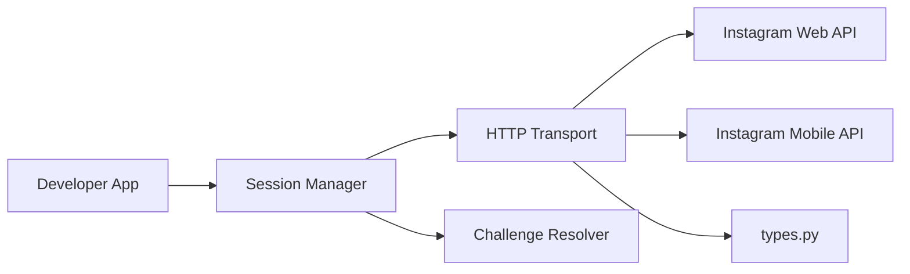

# subzeroid/instagrapi

> Wrapper Python non officiel des API privées d'Instagram, pour automatisation et recherche.

## Le problème
L'API officielle d'Instagram ne couvre pas la plupart des actions (DM, stories, recherche) utiles à l'automatisation.

## Ce que ça fait vraiment
Client unique combinant API web publique et API mobile privée (HTTP/2 via `curl_cffi`).
Connexion par mot de passe, 2FA, `sessionid`, persistance de session et résolution de challenges.
Utilisateurs, médias, stories, DM, commentaires, insights, uploads ; MQTT temps réel et push FBNS expérimentaux.
Le README lui-même conseille les API officielles ou un service hébergé pour la production.

## Comment c'est branché


## Essayer
```bash
pip install instagrapi
pip install "instagrapi[curl]"
uv add instagrapi
```

## Coût et pièges
Gratuit, mais comptes, proxys et appareils à gérer ; risque de blocage de compte.
Usage probablement contraire aux conditions d'Instagram ; README chargé de liens d'affiliation.

## Ce que ce n'est pas
Pas une API officielle ni stable : Meta peut casser les flux à tout moment.
Pas adapté à la production selon ses propres auteurs.

## Alternatives
- aiograpi : version asynchrone.
- Instaloader : téléchargement seul, sans automatisation authentifiée.
- HikerAPI : service hébergé payant.

## Pour toi
À ignorer : risque juridique et opérationnel élevé pour un intérêt data limité ; préfère les API officielles.
