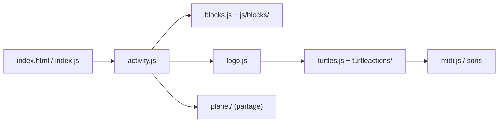

# sugarlabs/musicblocks

> Langage de programmation visuel par blocs pour explorer musique et mathématiques, destiné à l'éducation.

## Le problème
Enseigner la programmation et la musique ensemble demande un environnement visuel et sonore accessible depuis un simple navigateur.

## Ce que ça fait vraiment
Application web en JavaScript pur : on assemble des blocs (hauteur, rythme, graphisme, capteurs) qu'un interpréteur (`logo.js`) exécute via des « tortues » qui produisent son et dessin. Elle exporte en MIDI, MusicXML et LilyPond, offre des widgets (clavier, tempo, accordeur) et un module Planet de partage de projets. Turtle Blocks en est une vue centrée graphisme.

## Comment c'est branché


## Essayer
```bash
npm install
npm run dev
docker build -t musicblocks .
docker run -p 3000:3000 musicblocks
npm run lint && npx prettier --check . && npm test
```

## Coût et pièges
Gratuit ; une page web suffit. Le mode `file://` bride des fonctions : mieux vaut un serveur local. Le dépôt compte 364 issues ouvertes.

## Ce que ce n'est pas
Ce n'est pas un outil professionnel de composition. Le partage Planet est optionnel et non requis hors ligne.

## Alternatives
- Turtle Blocks JS : dont Music Blocks est un fork.
- Scratch et Snap : un guide dédié aux utilisateurs Snap est fourni.

## Pour toi
À ignorer : logiciel éducatif de musique visuelle, sans usage pour un travail data/IA/MLOps.

