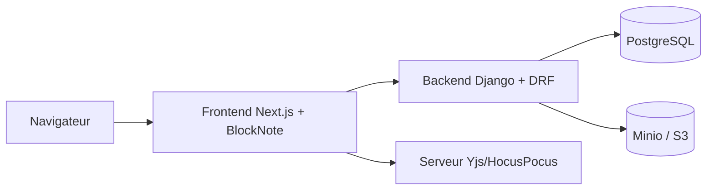

# suitenumique/docs

> Éditeur collaboratif open source, alternative à Notion, à héberger soi-même pour organisations publiques ou entreprises.

## Le problème
Les équipes écrivent et partagent leur savoir dans des outils fermés, hébergés hors de leur contrôle.

## Ce que ça fait vraiment
Édition riche et Markdown en temps réel (curseurs, commentaires, accès granulaires), sous-pages, hors ligne, import `.docx`/`.md`, export `.docx`/`.odt`/`.pdf`, mode présentation. Fonctions IA optionnelles (réécrire, résumer, traduire) branchées sur n'importe quel fournisseur via clé et URL. API pour intégrations (exemple : transcriptions Meet). Architecture : backend Django, frontend Next.js/BlockNote, serveur temps réel Yjs/HocusPocus.

## Comment c'est branché


## Essayer
```bash
make bootstrap FLUSH_ARGS='--no-input'
make run
make demo
```

## Coût et pièges
Docker, Docker Compose et GNU Make. Les paquets XL de BlockNote (dont l'export PDF) sont sous GPL, non compatibles MIT ; construire avec `PUBLISH_AS_MIT=true` pour s'en passer. Identifiants de dev par défaut : impress/impress. 369 issues ouvertes.

## Ce que ce n'est pas
Ce n'est pas un produit clé en main : le README décrit surtout un environnement de développement. Ce n'est pas purement MIT dès qu'on active les fonctions XL.

## Alternatives
Notion et Google Docs (cités comme références à remplacer) ; pas d'autre dépôt nommé.

## Pour toi
À surveiller : intéressant pour un wiki d'équipe souverain, avec API et IA branchable, mais la question GPL des paquets XL est à trancher avant tout usage commercial.

