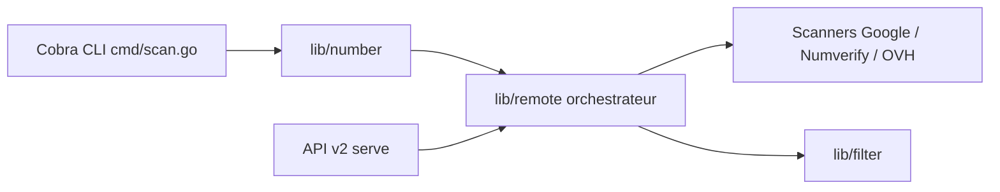

# sundowndev/phoneinfoga

> Outil d'OSINT en Go qui analyse un numéro de téléphone international via des scanners configurables.

## Le problème
Recueillir pays, opérateur, type de ligne et traces publiques d'un numéro demande de consulter plusieurs sources à la main.

## Ce que ça fait vraiment
Il normalise le numéro puis lance des scanners : local (pays, ligne), Numverify, OVH et recherches Google (CSE ou simple). Utilisable en CLI, en API REST (`serve`) ou via une interface Vue dans le navigateur. Le README précise qu'il ne localise pas un téléphone, ne le suit pas en temps réel et ne le pirate pas, et ne garantit pas l'exactitude des données. Le projet se déclare « stable mais non maintenu » et pourrait être archivé.

## Comment c'est branché

## Essayer
Le README fourni ne contient aucune commande d'installation ni d'usage. L'architecture indique les commandes `scan`, `scanners`, `serve` et `version`.

## Coût et pièges
Les scanners externes demandent des clés (Numverify, Google CSE). Projet sans maintenance : les bugs ne seront pas corrigés. Usage sur des numéros de tiers soumis au RGPD et à la loi locale.

## Ce que ce n'est pas
Ce n'est pas un traceur ni un outil d'intrusion. Les résultats ne sont pas vérifiés.

## Alternatives
Le README n'en cite aucune.

## Pour toi
À ignorer : outil d'enquête OSINT hors de ton périmètre data/IA, non maintenu et sensible côté données personnelles.

