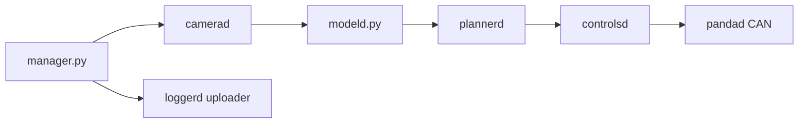

# sunnypilot/sunnypilot

> Fork d'openpilot, système d'aide à la conduite embarqué pour plus de 300 modèles de voitures.

## Le problème
Étendre les comportements d'aide à la conduite d'openpilot (engagement, régulateur, cartes) sur des véhicules compatibles.

## Ce que ça fait vraiment
Un superviseur lance des démons temps réel communiquant par messages cereal : caméra, capteurs, `pandad` (CAN), `modeld` (modèles ONNX), localisation, planification, contrôle, moniteur de conducteur, UI. Sunnypilot ajoute MADS, données cartographiques, modèles gérés et SunnyLink (gestion à distance). Le journal `loggerd` téléverse vers les serveurs comma.

## Comment c'est branché

## Essayer
Aucune commande documentée dans le README (installation via documentation et forum).

## Coût et pièges
Matériel dédié installé dans la voiture, non gratuit. Par défaut, des données de conduite sont envoyées aux serveurs comma ; le README parle de droit perpétuel accordé à comma sur ces données.

## Ce que ce n'est pas
Pas un produit : le texte parle d'un logiciel « alpha à des fins de recherche ». Le respect des lois est à ta charge.

## Alternatives
Le README cite openpilot de comma.ai, dont il est un fork.

## Pour toi
À ignorer : sécurité routière et matériel embarqué, avec télémétrie par défaut ; sans rapport avec un travail data, IA ou MLOps de bureau.

