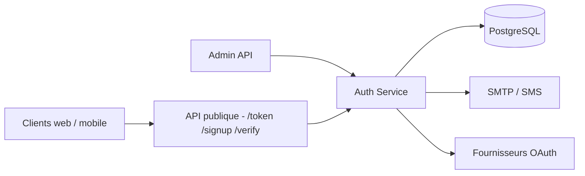

# supabase/auth

> Serveur Go d'authentification et de gestion d'utilisateurs derrière Supabase, avec JWT et connexions externes.

## Le problème
Écrire soi-même l'inscription, les liens magiques, les OTP, l'OAuth et la rotation de jetons est long et risqué.

## Ce que ça fait vraiment
Un serveur qui émet des JWT et gère utilisateurs, mots de passe, liens magiques, OTP par SMS et e-mail, MFA, connexions anonymes et fournisseurs externes (Google, GitHub, Apple, Keycloak, etc.). Il stocke ses données dans PostgreSQL (migrations automatiques). Il propose rotation des jetons de rafraîchissement, CAPTCHA (hCaptcha, Turnstile), limitation de débit, traces et métriques OpenTelemetry. Configuration par variables `GOTRUE_*`.

## Comment c'est branché


## Essayer
```bash
docker-compose -f docker-compose-dev.yml up postgres
make build
./auth
make dev
```

## Coût et pièges
Prévoir PostgreSQL, un service SMTP et, pour le SMS, un fournisseur (Twilio, MessageBird…). Le README recommande l'offre gérée de Supabase pour la production. Ne pas modifier le schéma géré par Auth ; placer le service derrière un proxy TLS.

## Ce que ce n'est pas
Ce n'est pas une bibliothèque Go : aucune garantie de compatibilité en usage comme paquet. Des fonctions héritées de GoTrue (multi-tenant, super admin) ne sont pas supportées.

## Alternatives
Aucune alternative nommée dans le README ; GoTrue de Netlify est l'origine du code.

## Pour toi
À surveiller : pertinent pour sécuriser l'accès à une application de données ou à une API d'IA, à condition d'exploiter PostgreSQL et le suivi des avis de sécurité.

